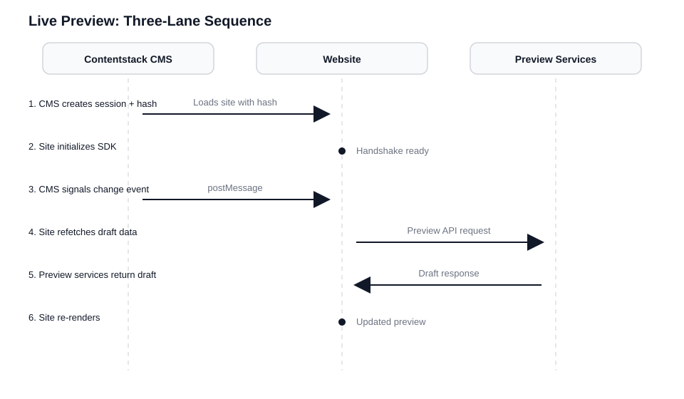
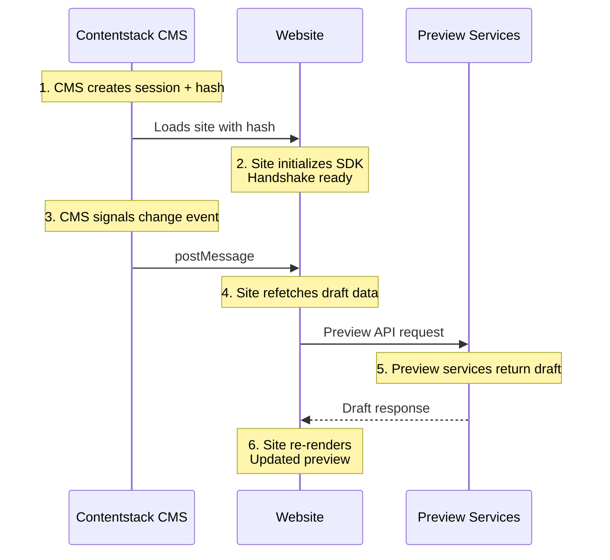
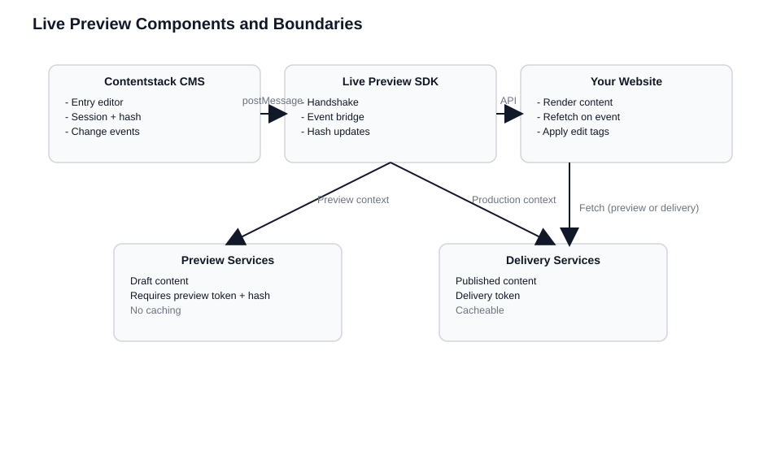
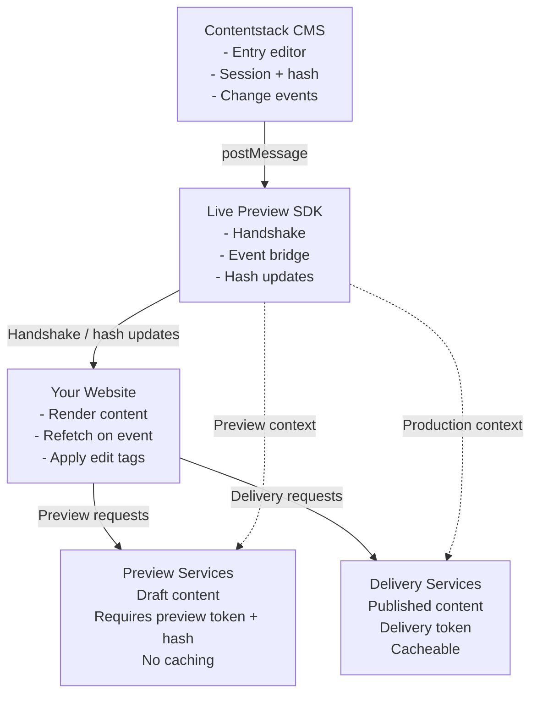
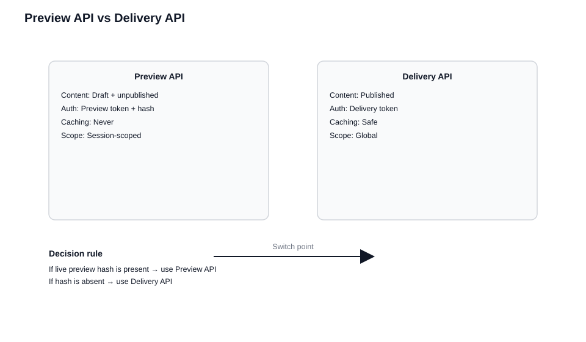
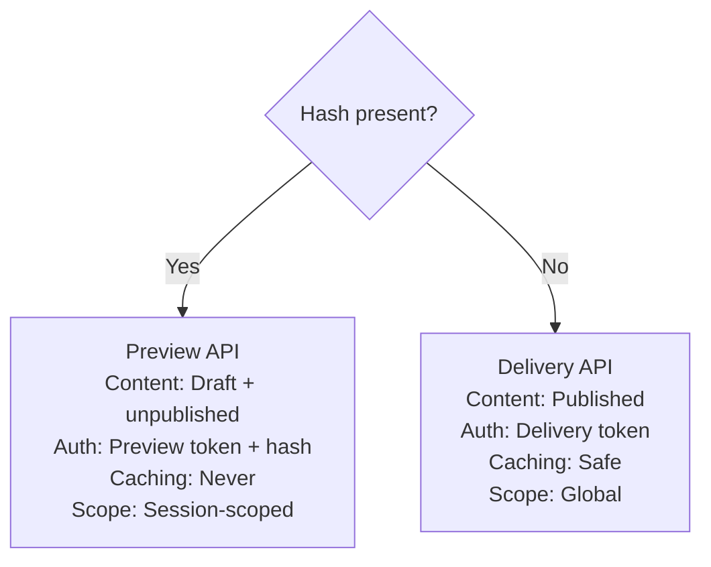
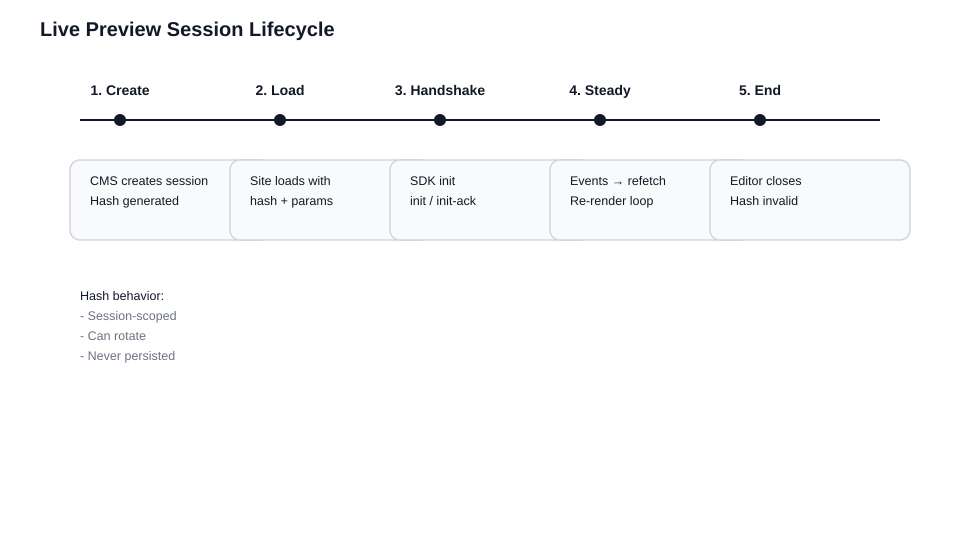
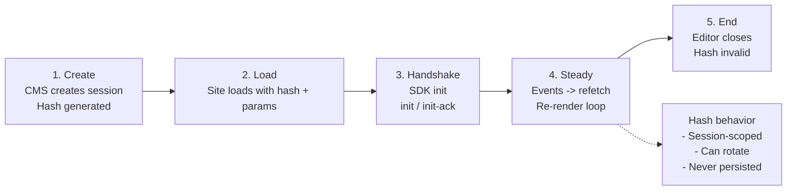

# How Live Preview Works

> **What you'll be able to do after this chapter:**
>
> - Describe the three participants in a Live Preview session and the role each plays
> - Explain why change events carry no payload and why your site must always refetch
> - Trace the full lifecycle of a preview hash from session creation to invalidation
> - Distinguish Preview API from Delivery API and know when to use each

**Why this matters:** Most Live Preview bugs trace back to a misunderstanding of the architecture. The mental model in this chapter prevents an entire class of problems: stale previews, broken navigation, cached drafts.

---

Live Preview is a coordinated, session-scoped conversation between three participants: the CMS where editors work, your running website, and the preview services that serve draft content. The CMS signals that something changed, your site decides how to re-render, and the preview services authorize and return draft data on demand.

This chapter covers the architecture, the session model, the APIs, and the communication protocol. Every concept is explained once here; the rendering strategy chapters that follow build on this foundation.

## The Mental Model

When an editor opens an entry with Live Preview enabled, three concurrent sessions begin:

**The content editing session** lives inside the entry editor. The CMS tracks every keystroke and field change, maintaining the authoritative state of draft content.

**The preview rendering session** runs in your site, loaded in an iframe within the CMS or in a separate browser tab. Your site initializes the Live Preview SDK, establishes communication with the CMS, and renders content using your normal rendering pipeline.

**The data access session** operates through the Preview API, which serves draft content scoped by a preview token and a live preview hash. The hash acts as a session identifier, preventing draft content from leaking across sessions.

These sessions are tightly coordinated but loosely coupled. The CMS doesn't need to know how your site renders. Your site doesn't need to understand the CMS's internal state. The Preview API doesn't care about your framework.

### The Flow of a Single Edit

An editor changes the About page headline from "Our Story" to "Our Mission" and tabs out of the field:

1. **Session establishment**: The CMS creates a Live Preview session and generates a unique hash
2. **Site loading**: Your site loads with the hash in the URL as a query parameter, along with content type UID, entry UID, and locale
3. **Handshake**: The SDK sends an initialization message to the CMS, the CMS acknowledges, and the communication channel opens
4. **Change notification**: The CMS emits a "content changed" event. This event does **not** contain the updated content - it only signals that something changed
5. **Refetch and re-render**: Your site fetches draft content from the Preview API using the current hash, then re-renders





Every edit follows this same pattern. The simplicity is deliberate - it makes the system predictable across frameworks.

### Two Architectural Consequences

**Live Preview never bypasses your data layer.** It always forces a refetch, so your rendering path stays honest. If your site has a bug, Live Preview exposes it rather than hiding it.

**Live Preview never pushes content into the DOM.** The CMS doesn't know your component structure, doesn't manipulate your state, and doesn't inject HTML. Your site receives a signal and decides what to do with it. Problems in preview almost always trace back to how you fetch and cache content, not to the CMS or SDK.

## The Five Components

### 1. Contentstack CMS (The Orchestrator)

- Hosts the entry editor where content modifications occur
- Detects changes as editors type, save, or publish
- Generates and rotates the live preview hash
- Loads your site in an iframe panel or opens it in a new browser tab
- Emits change events via postMessage

The CMS never pushes draft content directly to your site. It only signals that changes occurred.

### 2. Your Website (The Renderer)

- Renders content using your normal component structure
- Initializes the Live Preview SDK when loaded in preview context
- Listens for change events from the CMS
- Fetches draft content from preview services when appropriate

Your site remains in control of its rendering pipeline.

### 3. The Live Preview SDK (The Mediator)

- Establishes the postMessage handshake between CMS and your site
- Tracks session and hash state
- Adapts behavior for CSR vs SSR rendering models
- Exposes a clean API for subscribing to change events
- Manages the edit button and other UI affordances

The SDK is intentionally minimal. It doesn't fetch content, manage state, or render anything.

### 4. Preview Services (The Draft Data Source)

Preview services serve unpublished content with special authentication:

- **Preview token**: A credential from your stack settings that authorizes access to draft content
- **Live preview hash**: The session identifier that scopes which draft content you can access

The default REST preview endpoint is `rest-preview.contentstack.com` (North America). For other regions (EU, Azure, GCP), see the [region-specific endpoints](https://www.contentstack.com/docs/developers/contentstack-regions/api-endpoints).

### 5. Delivery Services (The Published Data Source)

The production-safe endpoints for published content. Optimized for stability, caching, and performance. Don't require the live preview hash and won't serve draft content.

### Quick Orientation: The Skeleton in Code

Here is how the five components map to the kickstart code from the introduction:

```typescript
// Component 5: Delivery Services + Component 4: Preview Services
import contentstack, { QueryOperation } from "@contentstack/delivery-sdk";
const stack = contentstack.stack({
  apiKey: "...",
  deliveryToken: "...",
  environment: "preview",
  live_preview: {
    enable: true,
    preview_token: "...",
    host: "rest-preview.contentstack.com", // Same SDK switches to this host when hash is active
  },
});

// Component 3: The SDK (Mediator)
import ContentstackLivePreview, {
  IStackSdk,
} from "@contentstack/live-preview-utils";
ContentstackLivePreview.init({
  ssr: false, // CSR loop: subscribe and refetch (see SSR chapter for reload-based flow)
  mode: "builder",
  stackSdk: stack.config as IStackSdk,
  stackDetails: { apiKey: "...", environment: "..." },
  editButton: { enable: true },
});

// Component 2: Your Website (Renderer)
ContentstackLivePreview.onEntryChange(async () => {
  // Event has no payload  - always query Preview API again for authoritative draft
  const result = await stack
    .contentType("page")
    .entry()
    .query()
    .where("url", QueryOperation.EQUALS, "/")
    .find();
  renderPage(result.entries?.[0]);
});
```





## Preview API vs Delivery API

The Preview API and Delivery API share the same REST routes, GraphQL schemas, query structure, and response shape. The difference is what content each serves and what authentication each requires.

**Delivery API** serves published content. Requires a delivery token. Fully cacheable. Use for production.

**Preview API** serves draft content including unsaved changes. Requires both a preview token AND the live preview hash. **Never cacheable** - the same request can return different content milliseconds later as the editor types. Use only during active preview sessions.





This distinction is a **trust boundary**. Mixing preview and delivery requests in the same flow produces a page with inconsistent data - part published, part draft - that matches neither the editor's view nor the production site.

### Authentication

The Preview API requires two additional credentials on top of the standard API key: a `preview_token` (from your stack settings) and the `live_preview` hash (from the current session). Both must be present for draft content to be returned.

```javascript
// Preview API headers: standard credentials + preview-specific ones
{
  "api_key": "your_stack_api_key",
  "access_token": "your_delivery_token",
  "preview_token": "your_preview_token",
  "live_preview": "current_session_hash"
}
```

### The Switch Logic

Centralize the decision. If you have a hash, use preview. If you don't, use delivery.

```javascript
function getContentstackConfig(previewHash) {
  const baseConfig = {
    apiKey: process.env.CONTENTSTACK_API_KEY,
    deliveryToken: process.env.CONTENTSTACK_DELIVERY_TOKEN,
    environment: process.env.CONTENTSTACK_ENVIRONMENT,
  };

  if (previewHash) {
    return {
      ...baseConfig,
      host: "rest-preview.contentstack.com",
      previewToken: process.env.CONTENTSTACK_PREVIEW_TOKEN,
      livePreviewHash: previewHash,
      // No CDN or app cache  - responses are per-session and change continuously
    };
  }

  return {
    ...baseConfig,
    host: "cdn.contentstack.io",
    // Standard delivery: cache-friendly
  };
}
```

## The Session Lifecycle and Hash

A Live Preview session begins when an editor opens an entry and ends when they close it. Everything in between is scoped to a single transient token: the live preview hash.

### What the Hash Is

The hash is a short-lived, session-scoped token that proves:

1. A valid preview session exists
2. The request is authorized (combined with the preview token)
3. The request is scoped to this editing session

The hash is **runtime state**, not a stack setting or environment variable. It's generated fresh for each editing session, can rotate during long sessions, and becomes invalid when the session ends.

### Strict Rules

- **Do not store the hash in a database.** It's runtime state, not persistent data.
- **Do not place the hash in a long-lived cookie.** Cookies persist across sessions. The hash must not.
- **Do not cache preview responses keyed by URL.** Two requests to the same URL with different hashes return different content.
- **Do not share the hash between users.** Each editing session has its own hash.

### The Lifecycle

**Session creation**: Editor opens an entry. CMS generates a unique hash.

**Site load**: CMS loads your site in an iframe (or new tab) with query parameters: `live_preview` (hash), `content_type_uid`, `entry_uid`, `locale`.

**Handshake**: SDK sends `init` to the CMS, receives `init-ack`. Communication channel is open.

**Steady state**: Editor types → CMS emits change event → SDK calls your callback → you refetch and re-render. This loop repeats for every edit.

**Session end**: Editor closes the entry. Hash becomes invalid. Preview API requests with the old hash fail.





The session outlives navigation within the preview iframe (clicking links), but it does not outlive the editor's engagement with the entry.

### Hash Rotation

During long editing sessions, the CMS may rotate the hash. Always read the current hash from the SDK (CSR) or from the current request parameters (SSR) rather than storing it at initialization.

## Communication Protocol

Live Preview uses the browser's `postMessage` API for cross-origin messaging between the CMS and your site (in the iframe). The SDK abstracts this into a clean event model.

### The Event Protocol

**`init`** (Site → CMS): Sent when the SDK initializes. Tells the CMS your site is ready.

**`init-ack`** (CMS → Site): Confirms the channel is open and the handshake is complete.

**`client-data-send`** (CMS → Site): Emitted when content changes. Does **not** contain the actual content - only signals that something changed. Your site responds by refetching.

### Events Carry Intent, Not Payload

This is a critical design principle. When you receive a change event, it means "something changed" - not "here's the new content." Your site decides what to fetch. Your data flow stays deterministic. Your fetch layer is the source of truth.

Attempting to extract field changes or apply deltas from events will fail. The events don't contain that information.

## Iframe vs New Tab

By default, Live Preview loads your site in an iframe within the CMS entry editor. Starting with SDK v4.0.0, Contentstack also supports opening the preview in a standalone browser tab - enable "Always Open in New Tab" in Settings > Live Preview.

The new-tab mode bypasses iframe restrictions (SSO, OAuth, `X-Frame-Options`, strict CSP headers). Both modes use the same `postMessage` communication. The SDK detects the context and adapts.

You can check the current context through `ContentstackLivePreview.config.windowType`:

- `"preview"`: iframe-based Live Preview or Timeline preview
- `"builder"`: Visual Builder iframe
- `"independent"`: direct browser access

---

## Key Takeaways

- Three-party system: CMS signals changes, your site refetches, Preview API serves drafts.
- Events carry intent, not payload. Always refetch; never extract content from events.
- The hash is runtime state: session-scoped, never cacheable, never persisted.
- Preview API and Delivery API share the same interface but serve different content. Don't mix them.
- The SDK is a thin mediator: postMessage handshake and session state only.

## Check Your Understanding

1. An editor opens an entry, makes a change, and your preview still shows the old content. Based on what you learned about the five components, which boundaries would you check first?
2. Why doesn't the CMS push updated content directly into your site's DOM? What would break if it did?
3. An editor closes an entry and reopens it five minutes later. Can the site reuse the hash from the previous session? Why or why not?
4. Your team proposes caching Preview API responses for 30 seconds to reduce API calls. Why is this unsafe?

## What's Next

You now have the architectural foundation. The next step is applying it to your specific rendering strategy.

- **If your app fetches content in the browser** (SPAs, client-side React/Vue): [Client-Side Rendering](./02-Client-Side%20Rendering.md)
- **If your server renders HTML per request**: [Server-Side Rendering](./03-Live%20Preview%20with%20Server-Side%20Rendering.md)
- **If your pages are built at deploy time**: [Static Site Generation](./04-Static%20Site%20Generation%20and%20Preview.md)
