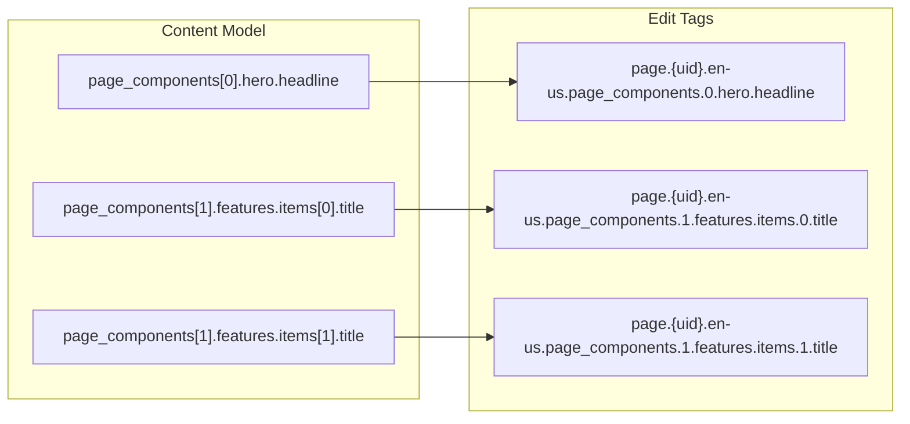
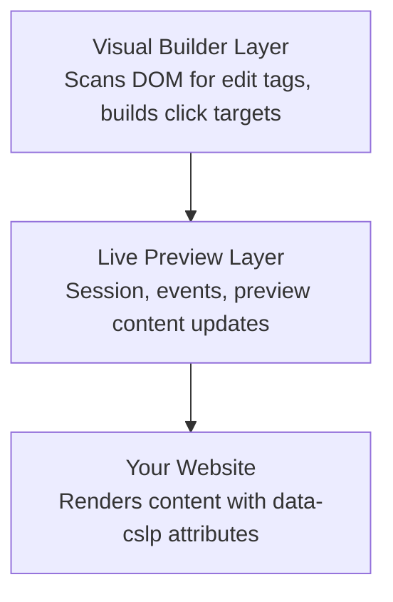

# Edit Tags and Visual Builder

> **Prerequisites:** This chapter builds on [How Live Preview Works](./01-How%20Live%20Preview%20Works.md). You should have a working Live Preview implementation (via any rendering strategy) before adding edit tags. Edit tags add interactivity _on top of_ Live Preview's real-time updates.

> **What you'll be able to do after this chapter:**
>
> - Add `data-cslp` edit tags to your components so editors can click any element to jump to its CMS field
> - Construct correct field paths for flat fields, nested modular blocks, repeated items, and referenced entries
> - Enable Visual Builder mode and understand how it scans the DOM to create an interactive editing surface
> - Make informed decisions about which elements to tag and which to skip

**Why this matters:** Edit tags let editors click on any rendered element to jump directly to its CMS field. Visual Builder takes this further, adding controls for reordering, adding, and deleting blocks directly in the preview.

---

Live Preview updates content in real time. Edit tags add the next layer: they let editors click directly on rendered elements to jump to the corresponding CMS field. Visual Builder uses these tags to transform your preview into an interactive editing surface.

## What Edit Tags Do

From the CMS's perspective, your rendered page is just HTML - it has no idea which entry produced the content or which fields map to which elements. Edit tags supply the missing context:

```html
<!-- Without edit tags: generic HTML -->
<h1>Welcome to Our Company</h1>
<p>We help businesses grow through innovative solutions.</p>

<!-- With edit tags: CMS knows which field each element maps to -->
<h1 data-cslp="page.blt123.en-us.title">Welcome to Our Company</h1>
<p data-cslp="page.blt123.en-us.description">We help businesses grow...</p>
```

Edit tags are metadata for editing, not content. Your site renders correctly without them - they add interactivity on top of Live Preview's real-time updates.

## Anatomy of an Edit Tag

Edit tags use the `data-cslp` attribute with a structured value:

```
data-cslp="{content_type_uid}.{entry_uid}.{locale}.{field_path}"
```

| Component          | Description                | Example                |
| ------------------ | -------------------------- | ---------------------- |
| `content_type_uid` | Content type identifier    | `page`, `blog_post`    |
| `entry_uid`        | Entry identifier           | `blt80654132ff521260`  |
| `locale`           | Language/locale code       | `en-us`, `de-de`       |
| `field_path`       | Path to the specific field | `title`, `body.0.text` |

For a simple field:

```
data-cslp="page.blt123.en-us.title"
```

For a nested field in a modular block:

```
data-cslp="page.blt123.en-us.page_components.0.hero.headline"
```

The field path must exactly match the path in your content model.

## Using addEditableTags

`addEditableTags` from `@contentstack/utils` is the recommended way to add edit tags to your entries. It walks the entry's field structure, builds the correct `data-cslp` paths for every field (including nested modular blocks and repeated items), and attaches them to a `$` property on the entry object. You don't need to construct paths manually - the utility handles content type UID, entry UID, locale, and field hierarchy for you.

This is the approach used in the kickstart projects and should be the default in any Live Preview implementation. Call it once in your data layer, immediately after fetching, and every component downstream gets correct edit tags for free.

### The Data Layer Pattern

Centralize `addEditableTags` in the function that fetches content. This way every component that receives the entry already has `$` populated:

```javascript
import contentstack from "@contentstack/delivery-sdk";
import { addEditableTags } from "@contentstack/utils";

export async function getPage(url) {
  const result = await stack
    .contentType("page")
    .entry()
    .query()
    .where("url", QueryOperation.EQUALS, url)
    .find();

  const entry = result.entries?.[0];

  if (entry) {
    // One call generates edit tags for every field in the entry
    addEditableTags(entry, "page", true, "en-us");

    // Also tag any referenced entries with their own content type
    if (entry.author) {
      addEditableTags(entry.author, "author", true, "en-us");
    }
  }

  return entry;
}

// entry.$.title → { 'data-cslp': 'page.blt123.en-us.title' }
// entry.$.page_components__0 → { 'data-cslp': 'page.blt123.en-us.page_components__0' }
// entry.author.$.name → { 'data-cslp': 'author.blt456.en-us.name' }
```

| Parameter          | Type    | Description                                                       |
| ------------------ | ------- | ----------------------------------------------------------------- |
| `entry`            | object  | The entry data from Contentstack                                  |
| `content_type_uid` | string  | The content type identifier                                       |
| `tagsAsObject`     | boolean | `true` returns `{ 'data-cslp': '...' }`, `false` returns a string |
| `locale`           | string  | The locale code                                                   |

### Using `$` in Components

Once `addEditableTags` has been called in the data layer, components simply spread from `entry.$`:

```jsx
// React (tagsAsObject: true) - just spread the $ property
<h1 {...entry.$?.title}>{entry.title}</h1>
<p {...entry.$?.description}>{entry.description}</p>
```

```html
<!-- EJS/Handlebars (tagsAsObject: false) -->
<h1 {{ entry.$.title }}>{{ entry.title }}</h1>
```

Every example in this chapter assumes `addEditableTags` was already called in the data layer. Components never call it themselves.

## Field Paths in Practice

For flat content models, paths are straightforward: `"title"`, `"body"`. For complex nested structures, paths must navigate the hierarchy:

```javascript
// Content model with modular blocks
{
  page_components: [
    { hero: { headline: "Welcome", subheading: "Your journey starts here" } },
    { features: { items: [{ title: "Fast" }, { title: "Secure" }] } },
  ];
}

// Field paths:
// "page_components.0.hero.headline"
// "page_components.0.hero.subheading"
// "page_components.1.features.items.0.title"
// "page_components.1.features.items.1.title"
```

**Accuracy matters more than coverage.** An incorrect path opens the wrong field and confuses editors. This is why `addEditableTags` is so valuable - it generates correct paths for the entire entry structure, including modular blocks and nested arrays, so you don't have to build them by hand.

### Modular Blocks

Each block has a type, an index in the array, and type-specific fields. When you call `addEditableTags` on the entry, it generates `$` properties for every level of nesting, including indexed keys like `page_components__0` for each block:

```jsx
// addEditableTags was already called in the data layer (see "Using addEditableTags" above)
// entry.$ now contains paths for all blocks and their fields

function PageComponents({ entry }) {
  return entry.page_components?.map((block, index) => {
    // addEditableTags generates `page_components__{index}` keys on entry.$
    const blockTag = entry.$?.[`page_components__${index}`];

    switch (block._content_type_uid) {
      case "hero_block":
        return (
          <HeroBlock key={index} block={block.hero_block} tag={blockTag} />
        );
      case "features_block":
        return (
          <FeaturesBlock
            key={index}
            block={block.features_block}
            tag={blockTag}
          />
        );
      default:
        return null;
    }
  });
}

function HeroBlock({ block, tag }) {
  return (
    <section {...tag}>
      {/* block.$ contains edit tags for fields within this block */}
      <h1 {...block.$?.headline}>{block.headline}</h1>
      <p {...block.$?.description}>{block.description}</p>
    </section>
  );
}
```




### Repeated Items Within Blocks

When blocks contain arrays, `addEditableTags` generates `$` properties on each array item too:

```jsx
function FeaturesBlock({ block, tag }) {
  return (
    <section {...tag}>
      <h2 {...block.$?.section_title}>{block.section_title}</h2>
      <ul>
        {block.items?.map((item, itemIndex) => (
          <li key={itemIndex}>
            {/* addEditableTags generates $ on each array item with the correct index */}
            <span {...item.$?.title}>{item.title}</span>
          </li>
        ))}
      </ul>
    </section>
  );
}
```

### Referenced Entries

Referenced entries have their own UIDs. The data layer pattern above already shows how to tag them separately with their own content type UID. In components, use `$` the same way as any other entry:

```jsx
function AuthorCard({ author }) {
  // author.$ was generated by addEditableTags with content type "author" in the data layer
  // Clicking opens the author entry directly, not the referencing field on the page
  return (
    <div>
      <h3 {...author.$?.name}>{author.name}</h3>
      <p {...author.$?.bio}>{author.bio}</p>
    </div>
  );
}
```

## Centralized Tag Helpers

If you fetch multiple content types, a helper can standardize how `addEditableTags` is called in your data layer:

```javascript
import { addEditableTags } from "@contentstack/utils";

// Call in your data layer after fetching - not in components
export function tagEntry(entry, contentTypeUid, locale = "en-us") {
  if (!entry) return entry;
  addEditableTags(entry, contentTypeUid, true, locale);
  return entry;
}

// Usage in data layer functions:
export async function getPage(url) {
  const result = await stack
    .contentType("page")
    .entry()
    .query()
    .where("url", QueryOperation.EQUALS, url)
    .find();
  return tagEntry(result.entries?.[0], "page");
}

export async function getHeader() {
  const result = await stack.contentType("header").entry().query().find();
  return tagEntry(result.entries?.[0], "header");
}
```

Components then use `entry.$?.fieldName` as usual - they don't know or care about the tagging:

```jsx
function HeroComponent({ entry }) {
  return (
    <div>
      <h1 {...entry.$?.title}>{entry.title}</h1>
      <p {...entry.$?.subtitle}>{entry.subtitle}</p>
    </div>
  );
}
```

## Granularity Trade-offs

**Tag these:** Primary content (headlines, body text, images), repeated items (list items, cards), CTAs and links, editable metadata.

**Skip these:** Structural elements (containers, wrappers), derived content (computed values, formatted dates - tag the source field), decorative elements.

Over-tagging clutters Visual Builder with too many clickable regions. Under-tagging forces editors to hunt through the entry form. Tag the content editors frequently modify.

## Visual Builder

Visual Builder transforms Live Preview from a passive display into an interactive editing surface. It's built entirely on top of Live Preview and edit tags - no new data flow, just an interaction layer.




### Enabling Visual Builder

Requires Live Preview Utils SDK v3.0+ and Delivery SDK v3.20.3+. Set `mode` to `"builder"`:

```javascript
ContentstackLivePreview.init({
  mode: "builder", // Enables DOM scanning + click-to-field on top of Live Preview
  stackDetails: {
    apiKey: "your-stack-api-key",
    environment: "your-environment",
  },
  editInVisualBuilderButton: {
    enable: true,
    position: "bottom-right", // Floating control to jump back into Visual Builder
  },
});
```

### How It Works

1. **DOM scanning**: Scans your page for elements with `data-cslp` attributes
2. **Region detection**: Calculates position and bounds for each tagged element
3. **Field mapping**: Parses the `data-cslp` value to extract content type, entry UID, locale, and field path
4. **Interaction binding**: Attaches event handlers to the regions
5. **Continuous monitoring**: Re-scans the DOM as the page updates

### What Makes It Work Well

- **Stable DOM structure**: If your DOM changes after scanning, the region map becomes stale
- **Consistent element-to-field mapping**: Each tag should consistently map to the same element
- **Predictable rendering**: Avoid rendering critical content only after client-side effects

### Common Failures

- **Missing edit tags**: Elements aren't clickable
- **Incorrect edit tags**: Clicking opens the wrong field
- **Dynamic DOM changes**: Elements work initially but stop after re-renders
- **Stale regions**: Visual Builder's map is out of sync after content updates

### Visual Builder and SSR

Server-rendered HTML must include `data-cslp` attributes. Client-side hydration must preserve them. After iframe reloads (SSR updates), Visual Builder re-scans automatically.

### Live Preview vs Visual Builder

| Feature                    | Live Preview | Visual Builder |
| -------------------------- | ------------ | -------------- |
| Real-time content updates  | Yes          | Yes            |
| Click to navigate to field | No           | Yes            |
| Visual editing controls    | No           | Yes            |
| Requires edit tags         | No           | Yes            |
| DOM scanning               | No           | Yes            |

## Visual Builder-Specific Features

### Multiple Field Actions

To let editors add, delete, and reorder blocks through Visual Builder, attach the edit tag to the parent wrapper using the `$` object:

```jsx
<div className="page-components">
  {entry.page_components?.map((component, index) => (
    // addEditableTags generates `page_components__{index}` keys on entry.$
    <div key={index} {...entry.$[`page_components__${index}`]}>
      <ComponentRenderer component={component} />
    </div>
  ))}
</div>
```

### Add Button Direction

Control the "Add" button placement with `data-add-direction`:

```jsx
<div className="page-components" data-add-direction="vertical">
  {/* block components */}
</div>
```

Values: `vertical`, `horizontal`, `none` (hides the button).

### Empty Block Placeholders

When a Modular Blocks field is empty, show a clickable placeholder:

```javascript
import { VB_EmptyBlockParentClass } from "@contentstack/live-preview-utils";
```

```jsx
{
  /* VB_EmptyBlockParentClass: drop zone when modular blocks field is empty */
}
<div
  className={`page-components ${VB_EmptyBlockParentClass}`}
  {...entry.$?.blocks}
>
  {entry.page_components?.map((component, index) => (
    <div key={index} {...entry.$[`page_components__${index}`]}>
      <ComponentRenderer component={component} />
    </div>
  ))}
</div>;
```

The kickstart's `Page.tsx` uses this exact pattern.

## GraphQL Considerations

GraphQL responses have a different shape than REST responses, and `addEditableTags` expects the REST shape. Two things need to happen before tagging works:

1. **Include `system` fields** in every query so you have UIDs
2. **Reshape the response** to match what `addEditableTags` expects

### The Query

Always request `system { uid, content_type_uid }` on every entry and referenced entry. For assets, use the `Connection` pattern that GraphQL requires:

```graphql
query Page($url: String!) {
  all_page(where: { url: $url }) {
    items {
      system {
        uid
        content_type_uid
      }
      title
      description
      url
      imageConnection {
        edges {
          node {
            url
            title
          }
        }
      }
      blocks {
        ... on PageBlocksBlock {
          __typename
          block {
            title
            copy
            layout
            imageConnection {
              edges {
                node {
                  url
                  title
                }
              }
            }
          }
        }
      }
    }
  }
}
```

### Reshaping for Edit Tags

`addEditableTags` expects `uid` and `_content_type_uid` at the root of the entry (not nested under `system`), and flat asset fields like `image` (not `imageConnection.edges[].node`). Reshape the GraphQL response before tagging:

```typescript
const fullPage = res?.all_page?.items?.[0];

const entry = fullPage && {
  ...fullPage,

  // Hoist system fields to root where addEditableTags expects them
  uid: fullPage.system?.uid,
  _content_type_uid: fullPage.system?.content_type_uid,

  // Flatten asset connections to plain fields
  image: fullPage.imageConnection?.edges?.[0]?.node,

  // Same treatment for modular blocks with nested connections
  blocks: fullPage.blocks?.map((block) => ({
    ...block,
    block: {
      ...block?.block,
      image: block?.block?.imageConnection?.edges?.[0]?.node || null,
    },
  })),
};
```

### Then Tag as Usual

Once reshaped, the standard `addEditableTags` call works exactly like the REST approach:

```typescript
import contentstack from "@contentstack/delivery-sdk";

if (entry) {
  contentstack.Utils.addEditableTags(entry, "page", true);
}

// entry.$ is now populated - components use entry.$?.title as usual
```

This reshaping pattern is used in the [Next.js GraphQL Kickstart](https://github.com/contentstack/kickstart-next-graphql). The key principle: get the data into the shape `addEditableTags` expects, then everything downstream (components, Visual Builder, edit tags) works identically regardless of whether you used REST or GraphQL to fetch it.

## Testing Edit Tags

1. Open Live Preview in Contentstack
2. Click elements on the page
3. Verify the correct field opens in the entry editor

| Action                   | Expected Result                                  |
| ------------------------ | ------------------------------------------------ |
| Click headline           | Title field opens                                |
| Click body text          | Body field opens                                 |
| Click item in list       | That specific item's field opens (correct index) |
| Click referenced content | Referenced entry opens                           |

If clicks open the wrong field, inspect the element's `data-cslp` value in devtools and compare the path to your content model structure. Off-by-one index errors and block type name typos are the most common causes.

## Preventing Drift

Since `addEditableTags` generates paths from the entry data itself, edit tags stay in sync with your content model automatically. You don't maintain a separate mapping. The main risk is in your components: if you rename a field in the content model, `entry.$?.old_field_name` silently returns `undefined` and the element loses its edit tag.

To catch this:

- **TypeScript types** matching your content model surface renamed or removed fields at compile time
- **Integration tests** that check elements have `data-cslp` attributes in the rendered output catch missing tags before deployment
- **Visual Builder's DOM scanner** highlights elements without tags during preview - if something stops being clickable, the field path changed

---

## Key Takeaways

- Edit tags (`data-cslp`) map rendered HTML to your content model. Without them, the CMS sees generic HTML.
- Format: `{content_type_uid}.{entry_uid}.{locale}.{field_path}`. Wrong path = wrong field opens.
- Call `addEditableTags` in your data layer, not in components.
- Tag what editors modify. Over-tagging clutters; under-tagging frustrates.
- Visual Builder scans the DOM for `data-cslp` attributes. No new data flow.
- Keep field paths in sync with your content model to prevent silent drift.

## Check Your Understanding

1. An editor clicks a headline in Visual Builder and the wrong field opens in the CMS. What's the most likely cause, and how would you diagnose it?
2. Your page renders a list of features from a modular block. The first three items work correctly in Visual Builder, but clicking the fourth item opens the third item's field. What's wrong?
3. Your page includes an author card that renders data from a referenced entry. Should the edit tag point to the referencing field on the page entry or to the referenced author entry? Why?
4. A colleague proposes adding `data-cslp` to every `<div>` wrapper in the component tree for maximum coverage. What's the practical downside?

## What's Next

- **To learn systematic debugging techniques and a checklist for every Live Preview implementation**: [Debugging and Best Practices](./07-Debugging%2C%20Pitfalls%2C%20and%20Best%20Practices.md)
