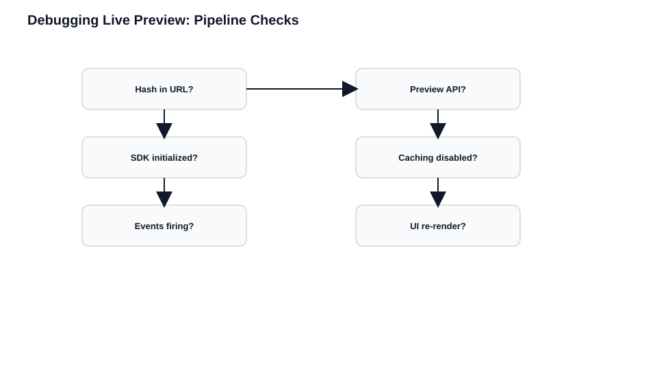
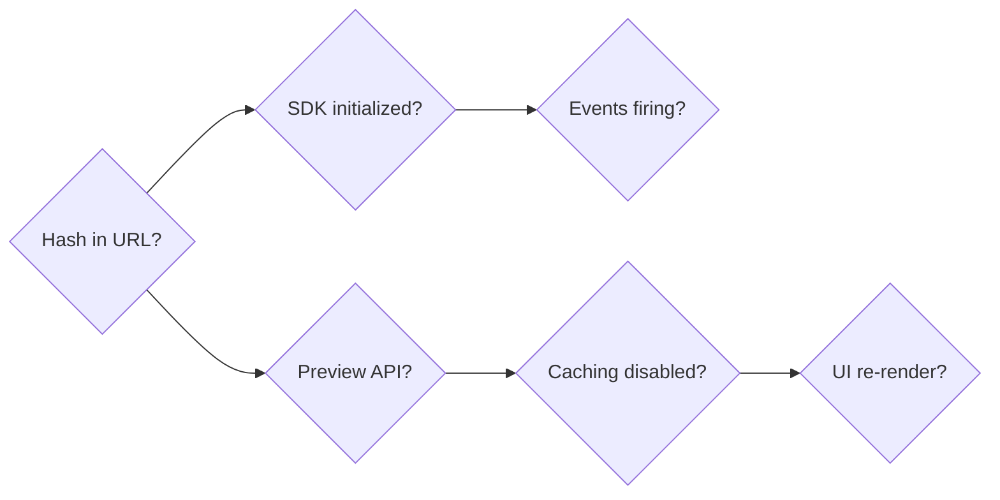

# Debugging, Pitfalls, and Best Practices

> **What you'll be able to do after this chapter:**
> - Systematically isolate Live Preview failures using the 6-step debugging sequence instead of guessing
> - Identify the five common failure modes by their symptoms and trace each to its root cause
> - Apply the preview checklist to any new page or component to catch issues before they reach production

**Why this matters:** Live Preview symptoms (stale content, no updates, wrong entry) rarely point directly to the cause. This chapter gives you a repeatable diagnostic process that isolates the problem layer by layer.

---

Most Live Preview problems fall into a small number of categories. A systematic approach isolates them faster than guessing.

## The Five Common Failure Modes

### 1. Missing or Dropped Hash

**Symptoms**: Preview shows published content instead of draft. First page works, navigation shows published content. "Preview randomly stops working."

**Causes**: Hash not extracted from URL. Hash not passed to content fetching. Navigation loses hash. Middleware strips query parameters. Redirects drop the hash.

**Investigation**: Check the URL in the preview iframe  - is `live_preview=...` present? Check network requests  - are they going to preview or delivery endpoints?

### 2. Cached Preview Responses

**Symptoms**: Changes don't appear even though preview seems connected. Old content persists. Different editors see each other's drafts.

**Causes**: CDN caching preview responses. Application-level caching not bypassed. Database persisting preview content.

**Investigation**: Check response headers for `Cache-Control`. Check your caching logic  - does it check for the hash before caching?

### 3. Shared SDK Instances in SSR

**Symptoms**: One editor's changes appear in another's preview. Preview shows wrong entry's content. Inconsistent behavior under load.

**Causes**: Global Contentstack SDK instance mutated per request. Preview state stored in module-level variables.

**Investigation**: Is the SDK instantiated once globally, or per request? Do you call `livePreviewQuery()` on a shared instance?

### 4. Incorrect SDK Configuration

**Symptoms**: Live Preview panel loads but doesn't update. Changes trigger no response.

**Causes**: `ssr: true` set for CSR site (or vice versa). SDK not initialized in browser context. Wrong `clientUrlParams.host` for your region. SDK initialized too late.

**Investigation**: Check your `ContentstackLivePreview.init()` call. Is `ssr` correct? Is the host correct?

### 5. Wrong API Endpoint

**Symptoms**: Preview shows published content. API calls succeed but return old data.

**Causes**: Using delivery endpoint when preview needed. Preview token not included. Hash not included.

**Investigation**: Check network requests  - what hostname is being called? What headers are included?

## Systematic Debugging

When Live Preview isn't working, walk through these steps in order:





### Step 1: Is the Hash in the URL?

Open devtools, find the preview iframe, check its `src` for `live_preview=...`. If missing, check Stack Settings > Live Preview and Environment Base URL configuration. Enable "Display Setup Status" for real-time feedback.

### Step 1b: Can the Iframe Load Your Site?

If the preview panel is blank, check for `X-Frame-Options: DENY` or strict CSP `frame-ancestors`. Either allow `https://*.contentstack.com` or use "Always Open in New Tab" (SDK v4.0.0+).

### Step 2: Is the SDK Initializing?

```javascript
// Empty string / undefined → not inside an active preview session (or init not run yet)
console.log('SDK hash:', ContentstackLivePreview.hash);
console.log('SDK config:', ContentstackLivePreview.config);
```

If not initializing: verify `init()` is called, runs in browser context, and executes early in the lifecycle.

### Step 3: Are Change Events Firing?

```javascript
ContentstackLivePreview.onEntryChange(() => {
  console.log('Entry change event received'); // Should log once per save/edit when handshake is healthy
});
```

Make an edit. If no log appears: check the handshake completed, verify the `ssr` setting matches your architecture.

### Step 4: Is the Correct API Being Used?

Log your fetch calls  - verify the endpoint is `rest-preview.contentstack.com` (or regional equivalent) and headers include `preview_token` and `live_preview`.

### Step 5: Is Caching Disabled?

Check response headers for `Cache-Control: no-store`. Check your code  - does any caching logic run when the hash is present?

### Step 6: Is the New Data Being Rendered?

If fetches return correct data but the UI doesn't update: check state updates, verify re-renders, look for framework-level caching.

## Common Pitfalls by Architecture

### CSR
1. Initializing SDK after first fetch
2. Not subscribing to changes (`onEntryChange` never registered)
3. Stale closures capturing old state/props
4. Memory leaks from missing cleanup

### SSR
1. Global SDK instance instead of request-scoped
2. Hash not extracted per request
3. Hash lost on navigation
4. Caching preview responses

### SSG
1. No preview mode enabled
2. Client-side patching causing hydration mismatches
3. Preview mode cookie/session not set correctly
4. Draft mode detection not checking `live_preview` param

## Best Practices

### Be Deliberately Conservative

- Treat preview as **runtime state**, not environment config
- Isolate preview logic so it's easy to reason about
- Prefer determinism over optimization  - refetch everything rather than selectively
- Document your preview architecture for future maintainers

### Preview Checklist

For every page or component that supports Live Preview:

- [ ] SDK initializes before content fetch
- [ ] Hash is extracted from current request (SSR) or SDK (CSR)
- [ ] Content is fetched from Preview API when hash present
- [ ] Caching is bypassed when hash present
- [ ] Navigation preserves preview parameters
- [ ] Edit tags are applied (if using Visual Builder)

## Quick Reference

| Symptom | First Check | Likely Cause |
|---------|-------------|--------------|
| Published content in preview | URL has hash? | Hash missing/dropped |
| Old content persists | Cache-Control header? | Caching preview responses |
| Wrong entry's content | SDK per-request? | Shared SDK instance |
| No updates after edit | Event callback fires? | SDK not initialized/configured |
| Preview works then stops | Hash in navigation URLs? | Hash lost on navigation |
| Iframe blank / connection error | X-Frame-Options or CSP? | Site blocks iframe embedding |
| "SDK not initialized" in setup UI | SDK init code present? | SDK missing or server-only |
| "Outdated SDK" warning | SDK version? | Update to v4.0.0+ |
| "Preview Service not enabled" | Using preview endpoints? | Migrate to Preview Service |

## Contentstack's Built-in Setup Status

Contentstack includes a troubleshooting UI that surfaces configuration errors in real time. Enable it at Settings > Live Preview > "Display Setup Status" toggle.

It checks for:
- **Could not connect to website**: CORS, `X-Frame-Options`, or incorrect Base URL
- **Live Preview SDK not initialized**: SDK `init` postMessage not received
- **Outdated Live Preview SDK version**: Update to v4.0.0+
- **Preview Service not enabled**: Follow the [Migrate to Preview Service](https://www.contentstack.com/docs/developers/set-up-live-preview/migrate-to-preview-service) guide
- **Default environment not set**: Set one in Settings > Live Preview

---

## Key Takeaways

- Five failure categories: missing hash, cached responses, shared SDK instances, wrong SDK config, wrong API endpoint.
- Debug in order: hash in URL, SDK init, events firing, correct API, caching disabled, data rendered.
- Treat preview as runtime state, not environment config.
- Use the checklist for every new page. Six checks upfront beats debugging after deployment.

## Wrap-Up: Where You Are Now

You've worked through the full Live Preview guide. Here's what you now have:

- **A mental model** of how the CMS, your site, and the Preview API coordinate to show draft content in real time (Chapter 1)
- **Implementation patterns** for your specific rendering strategy  - CSR, SSR, or SSG  - and the configuration each requires (Chapters 2-4)
- **Architectural patterns** for routing preview context through middleware, BFFs, and database caches without losing the hash (Chapter 5)
- **Edit tag and Visual Builder knowledge** to transform your preview from a passive display into an interactive editing surface (Chapter 6)
- **A diagnostic process** for when things break, plus a checklist for every new implementation (this chapter)

The concepts are consistent across the guide because the architecture is consistent: the CMS signals, your site refetches, the Preview API serves drafts, and the hash scopes everything to a session. Every chapter is a different angle on the same system.

If you're implementing Live Preview for the first time, start with the simplest rendering strategy that matches your architecture and get a single page working end to end. Expand from there. If you're debugging an existing implementation, the 6-step sequence in this chapter will isolate the issue faster than anything else.
