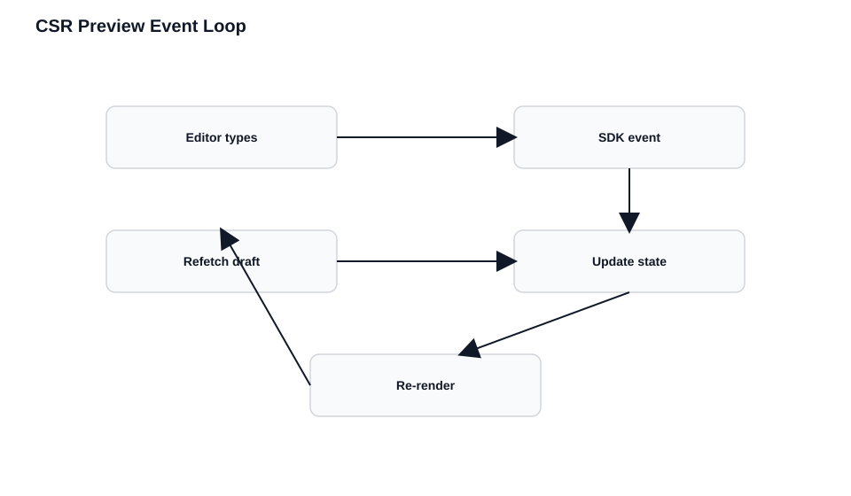

# Client-Side Rendering

CSR is the most natural fit for Live Preview. Your app is already wired to react to state changes — Live Preview just adds one more source of those changes. Updates happen in place without page reloads.

## The CSR Flow With Live Preview

```
Browser loads HTML/JS → App boots → SDK initializes → Fetch preview content → Render
                                          ↓
                                    Editor makes change
                                          ↓
                                    SDK receives event
                                          ↓
                                    Callback fires
                                          ↓
                                    Refetch preview content → Re-render
                                          ↓
                                    (repeat for each edit)
```



Everything after SDK initialization happens in the same runtime. Your app never reloads. State management, component trees, and event listeners all stay intact.

If you want to see this in a complete project, the kickstart's `Preview.tsx` from the introduction is a full CSR Live Preview implementation in under 20 lines.

## SDK Installation

```bash
npm install @contentstack/live-preview-utils @contentstack/delivery-sdk
```

Or include directly in HTML:

```html
<script type="module">
  import ContentstackLivePreview from 'https://esm.sh/@contentstack/live-preview-utils@3';
  ContentstackLivePreview.init({
    stackDetails: { apiKey: "your-stack-api-key" }
  });
</script>
```

## SDK Initialization

Initialize once, early in your application lifecycle, and only in browser context. The SDK must be ready before content fetching begins.

```javascript
import ContentstackLivePreview from "@contentstack/live-preview-utils";

ContentstackLivePreview.init({
  enable: true,
  ssr: false,  // Critical: CSR mode
  stackDetails: {
    apiKey: "your-stack-api-key",
    environment: "your-environment",
    branch: "main"
  },
  clientUrlParams: {
    protocol: "https",
    host: "app.contentstack.com",
    port: 443
  }
});
```

### Key Configuration Options

| Option | Type | Default | Description |
|--------|------|---------|-------------|
| `ssr` | boolean | true | Set to `false` for CSR mode |
| `stackDetails.apiKey` | string | required | Your stack's API key |
| `stackDetails.environment` | string | required | Environment name |
| `mode` | string | "preview" | `"builder"` for Visual Builder, `"preview"` for Live Preview |
| `stackSdk` | object | - | Stack class from `Contentstack.Stack()`. Required for CSR to inject hash and content type UID |
| `editButton.enable` | boolean | true | Show/hide the edit button |
| `cleanCslpOnProduction` | boolean | true | Remove `data-cslp` attributes when `enable` is false |

### Region-Specific Configuration

The `clientUrlParams.host` must match your Contentstack region:

```javascript
// North America (default)
clientUrlParams: { host: "app.contentstack.com" }

// European Union
clientUrlParams: { host: "eu-app.contentstack.com" }

// Azure North America
clientUrlParams: { host: "azure-na-app.contentstack.com" }

// Azure European Union
clientUrlParams: { host: "azure-eu-app.contentstack.com" }

// GCP North America
clientUrlParams: { host: "gcp-na-app.contentstack.com" }

// GCP European Union
clientUrlParams: { host: "gcp-eu-app.contentstack.com" }
```

### Initialization in React

```javascript
import { useEffect } from 'react';
import ContentstackLivePreview from "@contentstack/live-preview-utils";

function App() {
  useEffect(() => {
    ContentstackLivePreview.init({
      enable: true,
      ssr: false,
      stackDetails: {
        apiKey: process.env.NEXT_PUBLIC_CONTENTSTACK_API_KEY,
        environment: process.env.NEXT_PUBLIC_CONTENTSTACK_ENVIRONMENT
      }
    });
  }, []);

  return <YourAppContent />;
}
```

### Initialization in Vue

```javascript
import { createApp } from 'vue';
import ContentstackLivePreview from "@contentstack/live-preview-utils";

ContentstackLivePreview.init({
  enable: true,
  ssr: false,
  stackDetails: {
    apiKey: import.meta.env.VITE_CONTENTSTACK_API_KEY,
    environment: import.meta.env.VITE_CONTENTSTACK_ENVIRONMENT
  }
});

createApp(App).mount('#app');
```

## Subscribing to Changes

### onEntryChange()

The primary method for CSR. Fires when content is edited, saved, or published. The callback receives no content — you refetch.

```javascript
import { onEntryChange } from "@contentstack/live-preview-utils";

onEntryChange(() => {
  fetchContent();
});

// With options: skip the initial fire after registration
onEntryChange(fetchContent, { skipInitialRender: true });
```

### onLiveEdit()

Fires during real-time editing (as the user types). Use for immediate feedback without waiting for auto-save:

```javascript
import { onLiveEdit } from "@contentstack/live-preview-utils";

useEffect(() => {
  onLiveEdit(() => {
    fetchContent();
  });
}, []);
```

For most applications, `onEntryChange` is sufficient.

## Fetching With Preview Context

If you're using the Contentstack Delivery SDK configured with `live_preview`, it handles preview context automatically. For raw API calls, include the hash and preview token:

```javascript
// Delivery SDK: preview context is automatic
const data = await stack.contentType('page').entry('entry-uid').fetch();

// Raw API calls: include preview credentials
const hash = ContentstackLivePreview.hash;
const headers = hash ? {
  'preview_token': previewToken,
  'live_preview': hash
} : {};
```

## Accessing Preview Context

```javascript
import ContentstackLivePreview from "@contentstack/live-preview-utils";

const hash = ContentstackLivePreview.hash;
const config = ContentstackLivePreview.config;
// config.ssr, config.enable, config.stackDetails, config.windowType
```

`windowType` values: `"independent"` (direct browser), `"builder"` (Visual Builder iframe), `"preview"` (Live Preview / Timeline iframe).

## Updating State

Replace state atomically rather than merging:

```javascript
// Good: Replace state entirely
const fetchContent = async () => {
  const newData = await getContent();
  setContent(newData);
};

// Avoid: Partial merges can cause stale data
const fetchContent = async () => {
  const newData = await getContent();
  setContent(prev => ({ ...prev, ...newData }));
};
```

## Complete React Example

```javascript
// lib/contentstack.ts
import ContentstackLivePreview from "@contentstack/live-preview-utils";
import contentstack from "@contentstack/delivery-sdk";

const stack = contentstack.stack({
  apiKey: process.env.REACT_APP_API_KEY,
  deliveryToken: process.env.REACT_APP_DELIVERY_TOKEN,
  environment: process.env.REACT_APP_ENVIRONMENT,
  live_preview: {
    preview_token: process.env.REACT_APP_PREVIEW_TOKEN,
    enable: true,
    host: "rest-preview.contentstack.com"
  }
});

ContentstackLivePreview.init({
  enable: true,
  ssr: false,
  stackSdk: stack,
  stackDetails: {
    apiKey: process.env.REACT_APP_API_KEY,
    environment: process.env.REACT_APP_ENVIRONMENT
  }
});

export { stack, ContentstackLivePreview };
export const onEntryChange = ContentstackLivePreview.onEntryChange;

// pages/Home.jsx
import React, { useState, useEffect } from "react";
import { stack, onEntryChange } from "../lib/contentstack";

function Home() {
  const [pageContent, setPageContent] = useState(null);
  const [loading, setLoading] = useState(true);

  const fetchPageContent = async () => {
    try {
      const result = await stack
        .contentType("page")
        .entry("home-page-entry-uid")
        .fetch();
      setPageContent(result);
    } catch (error) {
      console.error("Failed to fetch content:", error);
    } finally {
      setLoading(false);
    }
  };

  useEffect(() => {
    onEntryChange(fetchPageContent);
  }, []);

  if (loading) return <div>Loading...</div>;
  if (!pageContent) return <div>Content not found</div>;

  return (
    <main>
      <h1>{pageContent.title}</h1>
      <div dangerouslySetInnerHTML={{ __html: pageContent.body }} />
    </main>
  );
}
```

## Multi-Entry Pages

If a page renders content from multiple entries, refetch all of them on any change:

```javascript
function PageWithMultipleEntries() {
  const [data, setData] = useState({ header: null, content: null, footer: null });

  const fetchAllContent = async () => {
    const [header, content, footer] = await Promise.all([
      stack.contentType("header").entry("header-uid").fetch(),
      stack.contentType("page").entry("page-uid").fetch(),
      stack.contentType("footer").entry("footer-uid").fetch()
    ]);
    setData({ header, content, footer });
  };

  useEffect(() => {
    onEntryChange(fetchAllContent);
  }, []);

  return (
    <>
      <Header data={data.header} />
      <Content data={data.content} />
      <Footer data={data.footer} />
    </>
  );
}
```

## Cleanup

Treat subscriptions as part of component lifecycle:

```javascript
useEffect(() => {
  let mounted = true;

  const fetchContent = async () => {
    if (!mounted) return;
    const data = await stack.contentType("page").entry("uid").fetch();
    if (mounted) setContent(data);
  };

  onEntryChange(fetchContent);

  return () => {
    mounted = false;
  };
}, []);
```

## Common CSR Failures

### Mistake 1: Assuming the Event Contains Content

```javascript
// Wrong: event doesn't contain content
onEntryChange((eventData) => {
  setContent(eventData.content);
});

// Correct: refetch on event
onEntryChange(() => {
  fetchContent();
});
```

### Mistake 2: Refetching Without Preview Context

```javascript
// Wrong: delivery API, no preview
const data = await fetch('https://cdn.contentstack.io/...');

// Correct: preview API with credentials
const hash = ContentstackLivePreview.hash;
const data = await fetch(`https://rest-preview.contentstack.com/...`, {
  headers: { 'preview_token': previewToken, 'live_preview': hash }
});
```

### Mistake 3: Forgetting Cleanup

```javascript
useEffect(() => {
  const unsubscribe = onEntryChange(fetchContent);
  return () => unsubscribe?.();
}, []);
```

### Mistake 4: Multiple Refetches Per Change

```javascript
// Problematic: each component subscribes independently → one edit triggers three refetches

// Better: centralized subscription at page level
function Page() {
  const fetchAllPageData = async () => {
    const [header, content, footer] = await Promise.all([
      fetchHeader(), fetchContent(), fetchFooter()
    ]);
    setPageData({ header, content, footer });
  };

  useEffect(() => {
    onEntryChange(fetchAllPageData);
  }, []);
}
```

Manual implementation without the SDK is possible but fragile and not recommended. The SDK handles postMessage handshakes, hash rotation, navigation, and cleanup that manual code invariably misses.

## Best Practices

1. **Initialize once, early** — before any content fetching
2. **Use `ssr: false`** — critical for CSR mode
3. **Single subscription per page** — avoid multiple components subscribing independently
4. **Refetch atomically** — replace state entirely, don't merge
5. **Handle loading states** — show indicators while refetching
6. **Clean up on unmount** — prevent memory leaks and stale updates
7. **Prefer the SDK** — manual implementations are fragile
