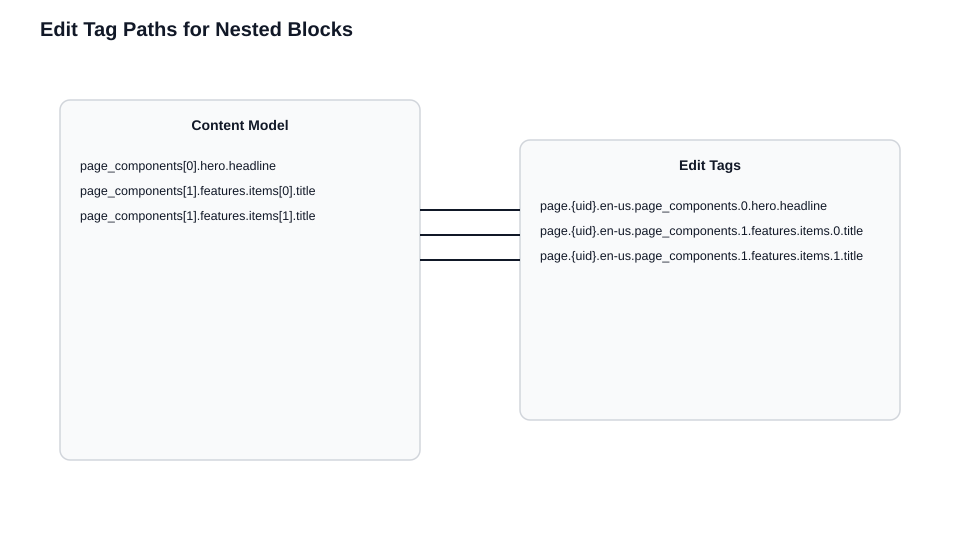
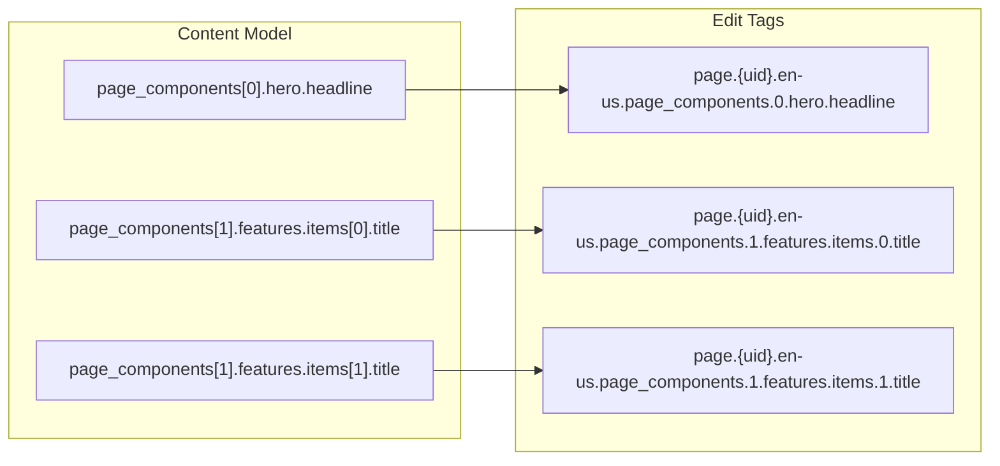
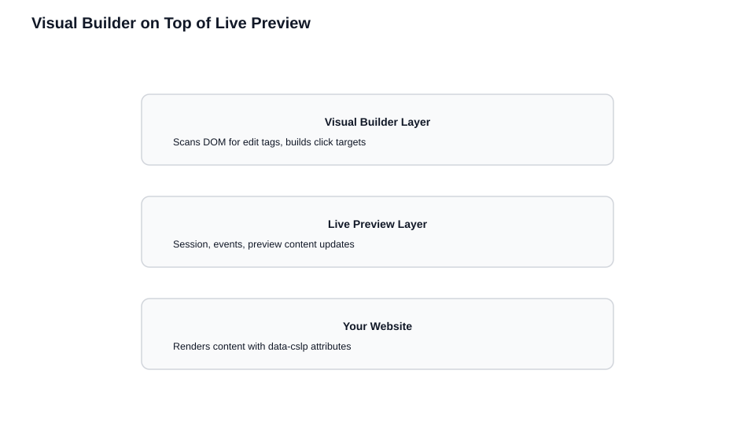
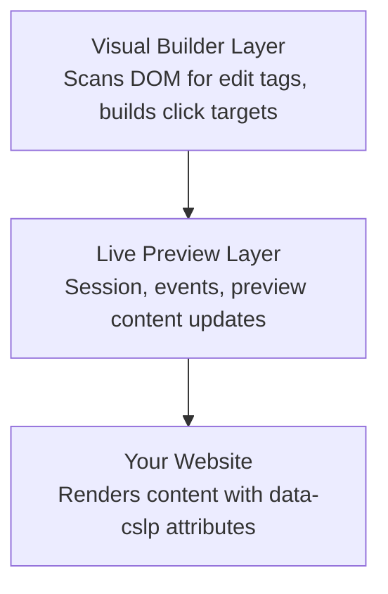

# Edit Tags and Visual Builder

> **Prerequisites:** This chapter builds on [How Live Preview Works](./How%20Live%20Preview%20Works.md). You should have a working Live Preview implementation (via any rendering strategy) before adding edit tags. Edit tags add interactivity *on top of* Live Preview's real-time updates.

> **What you'll be able to do after this chapter:**
> - Add `data-cslp` edit tags to your components so editors can click any element to jump to its CMS field
> - Construct correct field paths for flat fields, nested modular blocks, repeated items, and referenced entries
> - Enable Visual Builder mode and understand how it scans the DOM to create an interactive editing surface
> - Make informed decisions about which elements to tag and which to skip

**Why this matters:** Live Preview shows editors their changes. Edit tags let them *click* on any rendered element to jump directly to its field in the CMS. Without edit tags, editors must visually match content on the page to fields in the entry form — a tedious process that gets worse as content models grow. With edit tags, your preview becomes an interactive editing surface. Visual Builder takes this further, adding controls for reordering, adding, and deleting blocks directly in the preview.

---

Live Preview updates content in real time. Edit tags add the next layer: they let editors click directly on rendered elements to jump to the corresponding CMS field. Visual Builder uses these tags to transform your preview into an interactive editing surface.

## What Edit Tags Do

From the CMS's perspective, your rendered page is just HTML — it has no idea which entry produced the content or which fields map to which elements. Edit tags supply the missing context:

```html
<!-- Without edit tags: generic HTML -->
<h1>Welcome to Our Company</h1>
<p>We help businesses grow through innovative solutions.</p>

<!-- With edit tags: CMS knows which field each element maps to -->
<h1 data-cslp="page.blt123.en-us.title">Welcome to Our Company</h1>
<p data-cslp="page.blt123.en-us.description">We help businesses grow...</p>
```

Edit tags are metadata for editing, not content. Your site renders correctly without them — they add interactivity on top of Live Preview's real-time updates.

## Anatomy of an Edit Tag

Edit tags use the `data-cslp` attribute with a structured value:

```
data-cslp="{content_type_uid}.{entry_uid}.{locale}.{field_path}"
```

| Component | Description | Example |
|-----------|-------------|---------|
| `content_type_uid` | Content type identifier | `page`, `blog_post` |
| `entry_uid` | Entry identifier | `blt80654132ff521260` |
| `locale` | Language/locale code | `en-us`, `de-de` |
| `field_path` | Path to the specific field | `title`, `body.0.text` |

For a simple field:
```
data-cslp="page.blt123.en-us.title"
```

For a nested field in a modular block:
```
data-cslp="page.blt123.en-us.page_components.0.hero.headline"
```

The field path must exactly match the path in your content model.

## Using addEditableTags

Contentstack includes a utility that generates edit tag metadata automatically:

```javascript
import { addEditableTags } from "@contentstack/utils";

const entry = await stack.contentType("page").entry("uid").fetch();

// Add edit tag metadata to the entry object
addEditableTags(entry, "page", true, "en-us");

// The entry now has a $ key with edit tag mappings
// entry.$.title → { 'data-cslp': 'page.blt123.en-us.title' }
```

The kickstart's `getPage()` function demonstrates the recommended pattern: call `addEditableTags` immediately after fetching, before returning data to components. This keeps tag generation centralized in the data layer.

| Parameter | Type | Description |
|-----------|------|-------------|
| `entry` | object | The entry data from Contentstack |
| `content_type_uid` | string | The content type identifier |
| `tagsAsObject` | boolean | `true` returns `{ 'data-cslp': '...' }`, `false` returns a string |
| `locale` | string | The locale code |

**Usage in templates:**

```jsx
// React (tagsAsObject: true)
<h1 {...entry.$.title}>{entry.title}</h1>
```

```html
<!-- EJS/Handlebars (tagsAsObject: false) -->
<h1 {{ entry.$.title }}>{{ entry.title }}</h1>
```

## Field Paths in Practice

For flat content models, paths are straightforward: `"title"`, `"body"`. For complex nested structures, paths must navigate the hierarchy:

```javascript
// Content model with modular blocks
{
  page_components: [
    { hero: { headline: "Welcome", subheading: "Your journey starts here" } },
    { features: { items: [{ title: "Fast" }, { title: "Secure" }] } }
  ]
}

// Field paths:
// "page_components.0.hero.headline"
// "page_components.0.hero.subheading"
// "page_components.1.features.items.0.title"
// "page_components.1.features.items.1.title"
```

**Accuracy matters more than coverage.** An incorrect path opens the wrong field and confuses editors. Tag only elements you're confident about rather than guessing at complex paths.

### Modular Blocks

Each block has a type, an index in the array, and type-specific fields. The index is part of the field path:

```javascript
function PageComponents({ components }) {
  return components.map((block, index) => {
    // Index is part of the Contentstack field path for modular blocks
    const basePath = `page_components.${index}`;

    switch (block._content_type_uid) {
      case 'hero_block':
        return <HeroBlock key={index} block={block} basePath={basePath} />;
      case 'features_block':
        return <FeaturesBlock key={index} block={block} basePath={basePath} />;
      default:
        return null;
    }
  });
}

function HeroBlock({ block, basePath }) {
  const { tag } = useEditTags();
  return (
    <section {...tag(`${basePath}.hero_block`)}>
      {/* Paths must match block key names in the content model */}
      <h1 {...tag(`${basePath}.hero_block.headline`)}>{block.headline}</h1>
      <p {...tag(`${basePath}.hero_block.description`)}>{block.description}</p>
    </section>
  );
}
```





### Repeated Items Within Blocks

When blocks contain arrays, you need nested indexes:

```javascript
function FeaturesBlock({ block, basePath }) {
  const { tag } = useEditTags();
  return (
    <section {...tag(`${basePath}.features_block`)}>
      <h2 {...tag(`${basePath}.features_block.section_title`)}>{block.section_title}</h2>
      <ul>
        {block.items.map((item, itemIndex) => (
          <li key={itemIndex}>
            {/* Nested index in path → click targets the correct list item in the entry form */}
            <span {...tag(`${basePath}.features_block.items.${itemIndex}.title`)}>
              {item.title}
            </span>
          </li>
        ))}
      </ul>
    </section>
  );
}
```

### Referenced Entries

Referenced entries have their own UIDs. The edit tag should point to the referenced entry, not the referencing field:

```javascript
function AuthorCard({ author }) {
  // author is a separate entry — use its own UID for edit tags
  const { tag } = createEditTagHelper(author, 'author');
  return (
    <div>
      <h3 {...tag('name')}>{author.name}</h3>
      <p {...tag('bio')}>{author.bio}</p>
    </div>
  );
}
```

This lets editors click on the author's name and edit the author entry directly.

## Centralized Tag Helpers

Don't scatter edit tag string literals across components:

```javascript
// GOOD: Centralized helper — builds the data-cslp prefix once per entry
export function createEditTagHelper(entry, contentTypeUid, locale = 'en-us') {
  return {
    tag: (fieldPath) => ({
      'data-cslp': `${contentTypeUid}.${entry.system.uid}.${locale}.${fieldPath}`
    }),
    entry,
    locale
  };
}

function HeroComponent({ entry }) {
  const { tag } = createEditTagHelper(entry, 'page');
  return (
    <div>
      <h1 {...tag('hero.title')}>{entry.hero.title}</h1>
      <p {...tag('hero.subtitle')}>{entry.hero.subtitle}</p>
    </div>
  );
}
```

This keeps UID and locale handling in one place, makes field paths the only variable, and simplifies refactoring when content models change.

## Granularity Trade-offs

**Tag these:** Primary content (headlines, body text, images), repeated items (list items, cards), CTAs and links, editable metadata.

**Skip these:** Structural elements (containers, wrappers), derived content (computed values, formatted dates — tag the source field), decorative elements.

Over-tagging clutters Visual Builder with too many clickable regions. Under-tagging forces editors to hunt through the entry form. Tag the content editors frequently modify.

## Visual Builder

Visual Builder transforms Live Preview from a passive display into an interactive editing surface. It's built entirely on top of Live Preview and edit tags — no new data flow, just an interaction layer.

```
┌─────────────────────────────────────────────────────┐
│  VISUAL BUILDER: scans DOM for tags, adds controls  │
├─────────────────────────────────────────────────────┤
│  LIVE PREVIEW: session, events, draft content       │
├─────────────────────────────────────────────────────┤
│  YOUR WEBSITE: renders with data-cslp attributes    │
└─────────────────────────────────────────────────────┘
```





### Enabling Visual Builder

Requires Live Preview Utils SDK v3.0+ and Delivery SDK v3.20.3+. Set `mode` to `"builder"`:

```javascript
ContentstackLivePreview.init({
  mode: "builder", // Enables DOM scanning + click-to-field on top of Live Preview
  stackDetails: {
    apiKey: "your-stack-api-key",
    environment: "your-environment",
  },
  editInVisualBuilderButton: {
    enable: true,
    position: "bottom-right", // Floating control to jump back into Visual Builder
  },
});
```

### How It Works

1. **DOM scanning**: Scans your page for elements with `data-cslp` attributes
2. **Region detection**: Calculates position and bounds for each tagged element
3. **Field mapping**: Parses the `data-cslp` value to extract content type, entry UID, locale, and field path
4. **Interaction binding**: Attaches event handlers to the regions
5. **Continuous monitoring**: Re-scans the DOM as the page updates

### What Makes It Work Well

- **Stable DOM structure**: If your DOM changes after scanning, the region map becomes stale
- **Consistent element-to-field mapping**: Each tag should consistently map to the same element
- **Predictable rendering**: Avoid rendering critical content only after client-side effects

### Common Failures

- **Missing edit tags**: Elements aren't clickable
- **Incorrect edit tags**: Clicking opens the wrong field
- **Dynamic DOM changes**: Elements work initially but stop after re-renders
- **Stale regions**: Visual Builder's map is out of sync after content updates

### Visual Builder and SSR

Server-rendered HTML must include `data-cslp` attributes. Client-side hydration must preserve them. After iframe reloads (SSR updates), Visual Builder re-scans automatically.

### Live Preview vs Visual Builder

| Feature | Live Preview | Visual Builder |
|---------|--------------|----------------|
| Real-time content updates | Yes | Yes |
| Click to navigate to field | No | Yes |
| Visual editing controls | No | Yes |
| Requires edit tags | No | Yes |
| DOM scanning | No | Yes |

## Visual Builder-Specific Features

### Multiple Field Actions

To let editors add, delete, and reorder blocks through Visual Builder, attach the edit tag to the parent wrapper using the `$` object:

```jsx
<div className="page-components">
  {entry.page_components?.map((component, index) => (
    // addEditableTags generates `page_components__{index}` keys on entry.$
    <div key={index} {...entry.$[`page_components__${index}`]}>
      <ComponentRenderer component={component} />
    </div>
  ))}
</div>
```

### Add Button Direction

Control the "Add" button placement with `data-add-direction`:

```jsx
<div className="page-components" data-add-direction="vertical">
  {/* block components */}
</div>
```

Values: `vertical`, `horizontal`, `none` (hides the button).

### Empty Block Placeholders

When a Modular Blocks field is empty, show a clickable placeholder:

```javascript
import { VB_EmptyBlockParentClass } from '@contentstack/live-preview-utils';
```

```jsx
{/* VB_EmptyBlockParentClass: drop zone when modular blocks field is empty */}
<div className={`page-components ${VB_EmptyBlockParentClass}`} {...entry.$?.blocks}>
  {entry.page_components?.map((component, index) => (
    <div key={index} {...entry.$[`page_components__${index}`]}>
      <ComponentRenderer component={component} />
    </div>
  ))}
</div>
```

The kickstart's `Page.tsx` uses this exact pattern.

## GraphQL Considerations

Include `system` fields in queries to get the UIDs required for edit tags:

```graphql
query {
  all_page {
    items {
      system { uid, content_type_uid }
      title
      body
      page_components {
        ... on PageComponentsHero {
          hero {
            headline
            system { uid, content_type_uid }
          }
        }
      }
    }
  }
}
```

Without `system` fields, you won't have the entry UIDs needed to construct tags for referenced entries.

## Testing Edit Tags

1. Open Live Preview in Contentstack
2. Click elements on the page
3. Verify the correct field opens in the entry editor

| Action | Expected Result |
|--------|-----------------|
| Click headline | Title field opens |
| Click body text | Body field opens |
| Click item in list | That specific item's field opens (correct index) |
| Click referenced content | Referenced entry opens |

If clicks open the wrong field, inspect the element's `data-cslp` value in devtools and compare the path to your content model structure. Off-by-one index errors and block type name typos are the most common causes.

## Preventing Drift

As content models evolve, keep edit tags in sync:

```typescript
// Single source of truth for field paths — refactor when the content model changes
export const FIELD_PATHS = {
  page: {
    title: 'title',
    hero: {
      headline: 'hero.headline',
      subtitle: 'hero.subtitle',
    },
    components: (index: number, blockType: string, field: string) =>
      `page_components.${index}.${blockType}.${field}`
  }
} as const;

// Usage: tag(FIELD_PATHS.page.hero.headline) stays aligned with stack schema
<h1 {...tag(FIELD_PATHS.page.hero.headline)}>
```

Central constants, TypeScript types matching your content model, and integration tests that verify tags against the actual model all prevent silent drift.

---

## Key Takeaways

- Edit tags (`data-cslp` attributes) give the CMS the mapping it needs between your rendered HTML and your content model. Without them, your page is just generic HTML to the CMS.
- The `data-cslp` value follows a strict format: `{content_type_uid}.{entry_uid}.{locale}.{field_path}`. An incorrect path opens the wrong field.
- Use `addEditableTags` in your data layer (immediately after fetching) rather than constructing tags manually in components. This centralizes tag generation and keeps components clean.
- Tag content editors frequently modify. Over-tagging clutters the Visual Builder; under-tagging forces editors to hunt through the entry form. Skip structural wrappers and derived content.
- Visual Builder is a layer on top of Live Preview and edit tags. It scans the DOM for `data-cslp` attributes, calculates regions, and binds click interactions — no new data flow is introduced.
- Keep field paths in sync with your content model. Centralized path constants and TypeScript types prevent silent drift as models evolve.

## Check Your Understanding

1. An editor clicks a headline in Visual Builder and the wrong field opens in the CMS. What's the most likely cause, and how would you diagnose it?
2. Your page renders a list of features from a modular block. The first three items work correctly in Visual Builder, but clicking the fourth item opens the third item's field. What's wrong?
3. Your page includes an author card that renders data from a referenced entry. Should the edit tag point to the referencing field on the page entry or to the referenced author entry? Why?
4. A colleague proposes adding `data-cslp` to every `<div>` wrapper in the component tree for maximum coverage. What's the practical downside?

## What's Next

- **To learn systematic debugging techniques and a checklist for every Live Preview implementation**: [Debugging and Best Practices](./Debugging%2C%20Pitfalls%2C%20and%20Best%20Practices.md)
