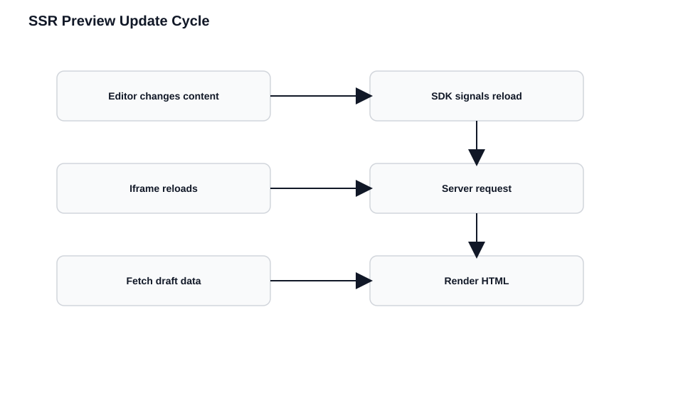

# Live Preview with Server-Side Rendering

In SSR, the server renders a complete page, sends it to the browser, and the server-side context is destroyed. Every preview update means a full round trip — there's no persistent process to receive events and refetch in place.

This contract holds regardless of your framework: Next.js, Nuxt, Remix, Astro SSR, Express, or custom Node.js.

## The SSR Live Preview Contract

Every SSR implementation must satisfy these requirements:

1. **Reload on change**: The browser reloads when content changes (no in-place updates)
2. **Hash on every request**: The server receives the preview hash with each request
3. **Per-request detection**: Preview vs production is determined per request, not globally
4. **Draft data fetching**: Use Preview API when hash is present
5. **No caching**: Preview responses must never be cached

## The Update Cycle

```
1. Editor types in CMS
         ↓
2. CMS emits change event via postMessage
         ↓
3. SDK (in browser) receives event
         ↓
4. SDK signals CMS: "reload needed" (ssr: true mode)
         ↓
5. CMS reloads iframe with current URL + hash
         ↓
6. Browser requests fresh page from server
         ↓
7. Server extracts hash, fetches draft content from Preview API
         ↓
8. Server renders HTML, browser displays updated preview
```



## First Request Correctness

The initial request already contains the hash. Your server must detect this immediately and fetch draft content.

```javascript
// WRONG: Ignores live_preview on first paint → published HTML, then draft = flicker/wrong state
export async function getServerSideProps() {
  const data = await fetchDeliveryAPI();
  return { props: { data } };
}

// CORRECT: Same request must use Preview API whenever the hash is present
export async function getServerSideProps({ query }) {
  const isPreview = !!query.live_preview;
  const data = isPreview
    ? await fetchPreviewAPI(query.live_preview)
    : await fetchDeliveryAPI();
  return { props: { data } };
}
```

## Request-Scoped Clients

This is where many SSR implementations fail. Preview configuration must be **request-scoped**, not application-scoped.

### The Wrong Way

```javascript
// DON'T: One stack for all users — concurrent requests overwrite each other's live_preview hash
const stack = contentstack.stack({ /* ... */ });

app.get('/*', async (req, res) => {
  stack.livePreviewQuery(req.query);
  const data = await stack.contentType('page').entry().find();
  res.render('page', { data });
});
```

Under load, requests interleave. One request's preview hash contaminates another. Editors see each other's drafts, or production users see draft content.

### The Right Way

```javascript
// DO: Isolate preview config to this request only
app.get('/*', async (req, res) => {
  const stack = createContentstackClient(req.query.live_preview);
  const data = await stack.contentType('page').entry().find();
  res.render('page', { data });
});

function createContentstackClient(livePreviewHash) {
  const config = {
    apiKey: process.env.API_KEY,
    deliveryToken: process.env.DELIVERY_TOKEN,
    environment: process.env.ENVIRONMENT
  };

  if (livePreviewHash) {
    config.live_preview = {
      enable: true,
      preview_token: process.env.PREVIEW_TOKEN,
      host: 'rest-preview.contentstack.com'
    };
  }

  const stack = contentstack.stack(config);

  // Binds this request's hash to SDK queries (must pair with live_preview config above)
  if (livePreviewHash) {
    stack.livePreviewQuery({ live_preview: livePreviewHash });
  }

  return stack;
}
```

## Disable All Caching for Preview

```javascript
// Preview responses are user- and session-specific; never cache at CDN or browser
if (isPreviewRequest(req)) {
  res.set('Cache-Control', 'no-store, no-cache, must-revalidate');
  res.set('Pragma', 'no-cache');
  res.set('Expires', '0');
}
```

Bypass CDN, application, and framework caches when the hash is present.

## Client-Side SDK Initialization

Even in SSR, the Live Preview SDK runs in the browser. It handles postMessage communication and tells the CMS to reload the iframe on changes.

```javascript
import ContentstackLivePreview from "@contentstack/live-preview-utils";

ContentstackLivePreview.init({
  enable: true,
  ssr: true, // Ask the parent frame to reload the iframe so the server runs again with a fresh hash
  stackDetails: {
    apiKey: "your-api-key",
    environment: "your-environment"
  }
});
```

## Hash Propagation in Navigation

The most common SSR preview bug: **the hash gets dropped during navigation**.

The editor opens a page, sees draft content, clicks a link, and suddenly sees published content. The link didn't include preview parameters.

```javascript
function navigateTo(url) {
  const currentUrl = new URL(window.location.href);
  const newUrl = new URL(url, window.location.origin);

  const previewHash = currentUrl.searchParams.get('live_preview');
  if (previewHash) {
    newUrl.searchParams.set('live_preview', previewHash);
    // CMS often adds these; carry them so the next SSR request stays in the same preview context
    ['content_type_uid', 'entry_uid', 'locale'].forEach(param => {
      const value = currentUrl.searchParams.get(param);
      if (value) newUrl.searchParams.set(param, value);
    });
  }

  window.location.href = newUrl.toString();
}
```

Also check middleware and redirects — they often strip query parameters.

## Framework Implementations

### Next.js (App Router)

```javascript
// app/layout.js
import LivePreviewInit from './LivePreviewInit';

export default function RootLayout({ children }) {
  return (
    <html>
      <body>
        {children}
        <LivePreviewInit />
      </body>
    </html>
  );
}

// app/LivePreviewInit.js
'use client';
import { useEffect } from 'react';
import ContentstackLivePreview from '@contentstack/live-preview-utils';

export default function LivePreviewInit() {
  useEffect(() => {
    ContentstackLivePreview.init({
      enable: true,
      ssr: true, // Triggers full iframe reloads so App Router RSC/SSR runs again per edit
      stackDetails: {
        apiKey: process.env.NEXT_PUBLIC_API_KEY,
        environment: process.env.NEXT_PUBLIC_ENVIRONMENT
      }
    });
  }, []);
  return null;
}

// app/[slug]/page.js
import { createContentstackClient } from '@/lib/contentstack';

export default async function Page({ params, searchParams }) {
  // searchParams includes live_preview on each iframe reload from the CMS
  const client = createContentstackClient(searchParams.live_preview);
  const data = await client.getEntry(params.slug);
  return <PageContent data={data} />;
}
```

### Next.js (Pages Router)

```javascript
// pages/[slug].js
export default function Page({ data }) {
  useEffect(() => {
    // Browser-side: coordinate reloads with the stack UI; server already fetched `data`
    ContentstackLivePreview.init({ enable: true, ssr: true, stackDetails: { /* ... */ } });
  }, []);
  return <PageContent data={data} />;
}

export async function getServerSideProps({ query }) {
  const client = createContentstackClient(query.live_preview);
  const data = await client.getEntry(query.slug);
  return { props: { data } };
}
```

### Nuxt.js

```javascript
// pages/[slug].vue
<script setup>
const route = useRoute();
const livePreviewHash = route.query.live_preview;

const { data } = await useFetch('/api/content', {
  // Forward hash to your server route so it can call Preview API for this session
  query: { slug: route.params.slug, live_preview: livePreviewHash }
});

onMounted(() => {
  import('@contentstack/live-preview-utils').then(({ default: LP }) => {
    LP.init({ enable: true, ssr: true, stackDetails: { /* ... */ } });
  });
});
</script>
```

### Express/Node.js

```javascript
app.get('/*', async (req, res) => {
  const livePreviewHash = req.query.live_preview;
  const client = createContentstackClient(livePreviewHash);

  const data = await client.getEntry(req.path);

  if (livePreviewHash) {
    res.set('Cache-Control', 'no-store');
  } else {
    res.set('Cache-Control', 'public, max-age=3600');
  }

  // Pass flag into template if you need to inject Live Preview script or edit tags only in preview
  const html = renderPage(data, livePreviewHash);
  res.send(html);
});
```

## Performance Expectations

SSR preview is inherently slower than CSR:

| Operation | CSR Preview | SSR Preview |
|-----------|-------------|-------------|
| Change to visible | ~100-300ms | ~500-2000ms |
| Network round trips | 1 (API fetch) | 2 (page load + API) |
| Server CPU | None | Full render |
| Perceived feel | Instant | Noticeable pause |

If preview speed is critical, consider using CSR mode for preview even if production uses SSR.

## Debugging SSR Preview

Check in order:

1. **Is the hash in the URL?** Check the iframe src in browser devtools
2. **Is the SDK initializing?** Check console for init logs
3. **Is `ssr: true` set?** Check your init configuration
4. **Is the server seeing the hash?** Add server logging
5. **Is the server using Preview API?** Log API endpoints being called
6. **Is caching disabled?** Check response headers
