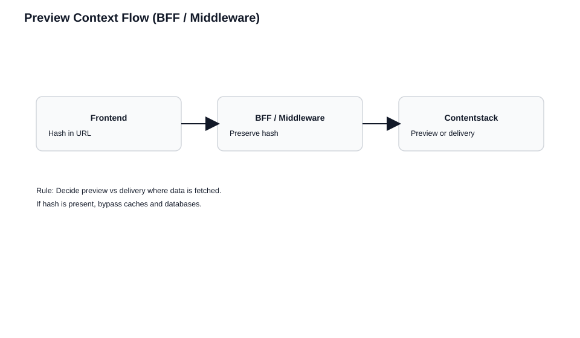

# Middleware and Database-Backed Architectures

> **Prerequisites:** This chapter builds on [How Live Preview Works](./How%20Live%20Preview%20Works.md) and assumes familiarity with at least one rendering strategy chapter ([CSR](./Client-Side%20Rendering.md), [SSR](./Live%20Preview%20with%20Server-Side%20Rendering.md), or [SSG](./Static%20Site%20Generation%20and%20Preview.md)). The core concepts — hash propagation, Preview vs Delivery API switching, and caching rules — apply here across additional architectural layers.

> **What you'll be able to do after this chapter:**
> - Route preview context through a BFF or API proxy without exposing tokens to the browser
> - Ensure edge middleware, redirects, and URL normalization preserve the live preview hash
> - Bypass database and memory caches for preview requests while keeping production caching intact

**Why this matters:** In production, content rarely flows directly from Contentstack to the browser. It passes through API proxies, BFF services, edge middleware, and sometimes a database cache. Each layer is a point where the live preview hash can be silently dropped, stripped, or ignored. When that happens, preview falls back to published content with no error — the failure is invisible. This chapter ensures the hash survives every layer.

---

Many production systems don't fetch content directly from Contentstack in the frontend. They use intermediary layers: BFF services, edge middleware, or database-backed caching. Live Preview works with all of these, but only if preview context flows end to end.

## The Core Rule

**Preview context must travel with the request.** The live preview hash needs to reach whatever layer actually fetches content from Contentstack. If the frontend assumes preview state while the backend fetches from delivery services, the page renders a mix of draft and published content.



## API Route as Content Proxy

Instead of calling Contentstack directly from the browser or server components, route all content requests through your own API endpoint. This keeps tokens server-side, centralizes endpoint switching, and lets the same fetch function work for both preview and production.

The [Next.js Middleware Kickstart](https://github.com/contentstack/kickstart-next-middleware) implements this pattern. Here's how it works.

### The API Route

A single API route handles all content requests. It reads query parameters to determine whether to call the Preview API or Delivery API:

```typescript
// app/api/middleware/route.ts
import contentstack from "@contentstack/delivery-sdk";

export async function GET(request: Request) {
  const { searchParams } = new URL(request.url);
  const content_type_uid = searchParams.get("content_type_uid");
  const pageUrl = searchParams.get("url");
  const live_preview = searchParams.get("live_preview");
  // Optional; stack may send it for time-aligned preview — forward when present
  const preview_timestamp = searchParams.get("preview_timestamp");

  // Pick the right API based on preview context
  const hostname = live_preview
    ? process.env.CONTENTSTACK_PREVIEW_HOST    // rest-preview.contentstack.com
    : process.env.CONTENTSTACK_DELIVERY_HOST;  // cdn.contentstack.io

  const headers = new Headers({
    "Content-Type": "application/json",
    "api_key": process.env.CONTENTSTACK_API_KEY,
  });

  if (live_preview) {
    headers.set("live_preview", live_preview);
    headers.set("preview_token", process.env.CONTENTSTACK_PREVIEW_TOKEN);
    if (preview_timestamp) headers.set("preview_timestamp", preview_timestamp);
  } else {
    headers.set("access_token", process.env.CONTENTSTACK_DELIVERY_TOKEN);
  }

  const query = encodeURIComponent(JSON.stringify({ url: pageUrl }));
  // v3 entries API: same path shape for preview and delivery; host + headers decide which service answers
  const apiUrl = `https://${hostname}/v3/content_types/${content_type_uid}/entries?environment=${process.env.CONTENTSTACK_ENVIRONMENT}&query=${query}`;

  const response = await fetch(apiUrl, { headers });
  const data = await response.json();
  const entry = data.entries?.[0];

  if (!entry) return Response.json({ error: "Not found" }, { status: 404 });

  // Add edit tags for Visual Builder when in preview
  if (live_preview) {
    contentstack.Utils.addEditableTags(entry, content_type_uid, true);
  }

  return Response.json(entry);
}
```

### The Fetch Function

Content fetching reads the hash from the SDK and passes it to the API route as a query parameter. The same function works whether called from a server component or a client component:

```typescript
// lib/contentstack.ts
import ContentstackLivePreview from "@contentstack/live-preview-utils";

export async function getPage(baseUrl: string, url: string) {
  // Populated inside the preview iframe after the SDK syncs with the parent frame
  const livePreviewHash = ContentstackLivePreview.hash;
  const apiUrl = new URL("/api/middleware", baseUrl);

  apiUrl.searchParams.set("content_type_uid", "page");
  apiUrl.searchParams.set("url", url);

  if (livePreviewHash) {
    apiUrl.searchParams.set("live_preview", livePreviewHash);
  }

  const result = await fetch(apiUrl);
  return result.json();
}
```

### Dynamic Rendering

The page component decides how to render based on whether preview is active. Preview uses CSR (client-side refetch loop), production uses SSR (server-rendered):

```typescript
// app/page.tsx
export default async function Home() {
  // Preview: client subtree owns SDK + refetch; production: server calls proxy without hash
  if (isPreview) return <Preview path="/" baseUrl={baseUrl} />;

  const page = await getPage(baseUrl, "/");
  return <Page page={page} />;
}
```

The `<Preview>` component initializes the Live Preview SDK with `ssr: false`, subscribes to `onEntryChange`, and refetches through the same `/api/middleware` route on every edit. The `<Page>` component is a static renderer — no SDK, no subscriptions.

This works because the API route doesn't care who's calling it. The preview component calls it with a hash and gets draft content. The server component calls it without a hash and gets published content. Same route, same logic, different results.

### Why This Pattern

- **Tokens never reach the browser** — preview tokens and delivery tokens stay in server-side environment variables
- **Single place for endpoint switching** — one `if (live_preview)` check instead of scattered logic
- **Works with any rendering strategy** — CSR, SSR, or both through the same API route
- **Easy to extend** — add logging, rate limiting, or response transformation in one place

## Backend-for-Frontend (BFF) Architecture

The proxy pattern above generalizes to any BFF architecture. The frontend calls your BFF, the BFF fetches from Contentstack, and the BFF returns processed content. The BFF must know about preview context:

Frontend forwards preview parameters:

```javascript
async function fetchPage(slug) {
  const params = new URLSearchParams(window.location.search);
  const livePreviewHash = params.get('live_preview');

  const url = new URL(`/api/page/${slug}`, window.location.origin);
  if (livePreviewHash) {
    url.searchParams.set('live_preview', livePreviewHash); // BFF must echo this to Contentstack
  }

  const response = await fetch(url);
  return response.json();
}
```

BFF detects preview and switches API:

```javascript
app.get('/api/page/:slug', async (req, res) => {
  const livePreviewHash = req.query.live_preview;
  const client = createContentstackClient(livePreviewHash); // Request-scoped preview config (see SSR chapter)
  const data = await client.getPageBySlug(req.params.slug);

  if (livePreviewHash) {
    res.set('Cache-Control', 'no-store');
  } else {
    res.set('Cache-Control', 'public, max-age=300');
  }

  res.json(data);
});
```

## Edge Middleware

Edge middleware (Vercel Edge, Cloudflare Workers, Lambda@Edge) runs between the CDN and your origin. Three common pitfalls:

### Pitfall 1: Stripping Query Parameters

```javascript
// DANGEROUS: This breaks Live Preview
export function middleware(request) {
  const url = new URL(request.url);
  url.search = '';  // Removes live_preview!
  return NextResponse.rewrite(url);
}

// FIX: Preserve preview parameters
export function middleware(request) {
  const url = new URL(request.url);
  const previewParams = ['live_preview', 'content_type_uid', 'entry_uid', 'locale'];
  const preserved = new URLSearchParams();

  previewParams.forEach(param => {
    const value = url.searchParams.get(param);
    if (value) preserved.set(param, value);
  });

  url.search = preserved.toString();
  return NextResponse.rewrite(url);
}
```

### Pitfall 2: URL Normalization

```javascript
// DANGEROUS: Redirect may lose query params
export function middleware(request) {
  const url = new URL(request.url);
  if (!url.pathname.endsWith('/')) {
    url.pathname += '/';
    return NextResponse.redirect(url); // Relative redirects can drop search string depending on runtime
  }
}

// FIX: Use URL constructor (preserves search params by default)
export function middleware(request) {
  const url = new URL(request.url);
  if (!url.pathname.endsWith('/')) {
    const newUrl = new URL(url);
    newUrl.pathname += '/';
    return NextResponse.redirect(newUrl);
  }
}
```

### Pitfall 3: Authentication Redirects

```javascript
// DANGEROUS: Redirect loses preview context
export function middleware(request) {
  if (!isAuthenticated(request)) {
    return NextResponse.redirect('/login');  // Preview params lost!
  }
}

// FIX: Forward preview params
export function middleware(request) {
  if (!isAuthenticated(request)) {
    const loginUrl = new URL('/login', request.url);
    const previewHash = request.nextUrl.searchParams.get('live_preview');
    if (previewHash) {
      loginUrl.searchParams.set('return_preview', previewHash);
    }
    return NextResponse.redirect(loginUrl);
  }
}
```

## Database-Backed Content Caching

Some architectures sync Contentstack content to a local database for performance. Preview content must **never** be written to the database:

```javascript
async function getContent(slug, livePreviewHash) {
  if (livePreviewHash) {
    // ALWAYS fetch directly from Contentstack for preview
    // Never read from or write to database
    return fetchFromContentstackPreview(slug, livePreviewHash);
  }

  // Production: Read from database
  const cached = await database.findBySlug(slug);
  if (cached) return cached;

  const fresh = await fetchFromContentstackDelivery(slug);
  await database.upsert(slug, fresh);
  return fresh;
}
```

Preview content is session-scoped. Writing it to shared storage means other users might see drafts, content might outlive the editing session, and different editors' drafts might overwrite each other.

### Bypassing the Cache Layer

```javascript
class ContentService {
  async getPage(slug, options = {}) {
    const { livePreviewHash } = options;

    if (livePreviewHash) {
      // Bypass all caches for preview
      return this.fetchFromPreviewAPI(slug, livePreviewHash);
    }

    return this.fetchWithCaching(slug);
  }

  async fetchFromPreviewAPI(slug, hash) {
    const response = await fetch(
      `https://rest-preview.contentstack.com/...`,
      {
        headers: {
          'preview_token': process.env.PREVIEW_TOKEN,
          'live_preview': hash
        }
      }
    );
    return response.json();
    // No caching, no database write
  }

  async fetchWithCaching(slug) {
    const memCached = this.memoryCache.get(slug);
    if (memCached) return memCached;

    const dbCached = await this.database.findBySlug(slug);
    if (dbCached) {
      this.memoryCache.set(slug, dbCached);
      return dbCached;
    }

    const fresh = await this.fetchFromDeliveryAPI(slug);
    await this.database.upsert(slug, fresh);
    this.memoryCache.set(slug, fresh);
    return fresh;
  }
}
```

## Server-Side Data Aggregation

When pages combine content from multiple sources, only Contentstack content uses the preview hash:

```javascript
async function getPageData(slug, livePreviewHash) {
  const [content, products, user] = await Promise.all([
    livePreviewHash
      ? fetchContentstackPreview(slug, livePreviewHash)
      : fetchContentstackDelivery(slug),

    fetchProducts(), // Commerce/CMS-agnostic sources: keep on delivery paths
    fetchCurrentUser()
  ]);

  return { content, products, user, isPreview: !!livePreviewHash };
}
```

## Debugging Context Propagation

When Live Preview isn't working in a complex architecture, trace the hash through each layer:

1. **Is the hash in the initial URL?** Check browser devtools
2. **Does the frontend forward the hash to the BFF?** Log BFF requests
3. **Does the BFF use preview API?** Log API calls
4. **Does middleware preserve the hash?** Log before/after middleware
5. **Is the database being bypassed?** Check data source for preview requests

---

## Key Takeaways

- The core rule is simple: preview context must travel with the request, end to end. Every layer between the browser and the Contentstack API must forward the hash.
- An API route / BFF proxy centralizes token management (keeping preview tokens server-side) and endpoint switching (one `if (live_preview)` check instead of scattered logic).
- Edge middleware is a common source of silent hash loss. URL normalization, parameter stripping, and authentication redirects can all drop the `live_preview` query parameter.
- Preview content must never be written to a shared database or persistent cache. It's session-scoped and transient — storing it means other users might see drafts or stale sessions.

## Check Your Understanding

1. Your BFF returns cached content for performance. An editor activates Live Preview, but their changes don't appear. What's the most likely cause, and how would you fix the BFF to handle both preview and production correctly?
2. Why should preview content never be written to a shared database, even temporarily? What would happen if two editors previewed the same page simultaneously and your database stored both drafts?
3. Your edge middleware normalizes URLs by adding a trailing slash with a redirect. Why might this break Live Preview, and how would you fix it?

## Exercise: Trace the Hash

Map the path the live preview hash takes through your own architecture, from the CMS iframe URL to the final Contentstack API call. For each layer, answer:

1. Does this layer receive the hash? How? (query parameter, header, cookie)
2. Does this layer forward the hash? To where?
3. Could this layer silently drop the hash? (redirects, URL rewrites, parameter stripping)
4. Does this layer cache responses? Is caching bypassed when the hash is present?

If you find a gap — a layer that doesn't forward the hash or doesn't bypass caching — that's where your preview will break.

## What's Next

- **To add click-to-edit and Visual Builder capabilities**: [Edit Tags and Visual Builder](./Edit%20Tags%20and%20Visual%20Builder.md)
- **To systematically debug preview issues**: [Debugging and Best Practices](./Debugging%2C%20Pitfalls%2C%20and%20Best%20Practices.md)
