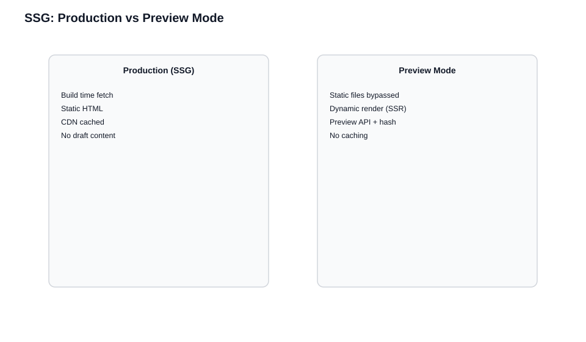

# Static Site Generation and Preview

> **Prerequisites:** This chapter builds on [How Live Preview Works](./How%20Live%20Preview%20Works.md) and shares concepts with [Server-Side Rendering](./Live%20Preview%20with%20Server-Side%20Rendering.md). Understanding why preview requires runtime rendering helps you see why SSG needs an escape hatch.

> **What you'll be able to do after this chapter:**
> - Explain why SSG fundamentally conflicts with Live Preview and what the escape hatch is
> - Configure Next.js Draft Mode or Astro hybrid rendering for preview
> - Avoid the client-side patching antipattern and the hydration mismatches it causes

**Why this matters:** SSG is the hardest rendering strategy for Live Preview because static files fundamentally cannot show drafts — there's no server to fetch them and no runtime to respond to changes. Teams that try to patch static content with client-side refetching hit hydration mismatches, layout flicker, and inconsistent state. This chapter shows you the framework-level escape hatches that make preview work cleanly.

---

SSG's core value (pre-built HTML served without runtime computation) directly conflicts with Live Preview's need for draft-aware, session-scoped content. Static files can't show drafts. The solution: framework-level preview modes that temporarily switch from static to dynamic rendering.

## The Fundamental Conflict

At build time, your generator fetches published content and renders HTML files. These files are deployed to a CDN. No server runs, no API calls fire per request. Live Preview needs runtime rendering of draft content — rebuilding and redeploying on every keystroke isn't practical.

## The Solution: Preview Mode

When preview mode is active, static files are bypassed and requests are handled dynamically (like SSR), fetching from the Preview API per request. When inactive, static files serve normally with no performance impact.

**Conceptually, SSG preview is SSR with guardrails.**

| Aspect | Production (SSG) | Preview Mode |
|--------|------------------|--------------|
| Rendering | Static files | Dynamic (SSR) |
| Content source | Built-in content | Preview API |
| Caching | Full CDN cache | No caching |
| Hash handling | Not applicable | Per-request |



## Framework Preview Modes

### Next.js (App Router with Draft Mode)

```javascript
// app/api/draft/route.js
import { draftMode } from 'next/headers';

export async function GET(request) {
  const { searchParams } = new URL(request.url);
  const secret = searchParams.get('secret');
  const slug = searchParams.get('slug');

  if (secret !== process.env.PREVIEW_SECRET) {
    return new Response('Invalid token', { status: 401 });
  }

  // Cookie-backed flag: subsequent requests render dynamically and can use Preview API
  draftMode().enable();

  return new Response(null, {
    status: 307,
    headers: { Location: `/${slug}` }
  });
}

// app/[slug]/page.js
import { draftMode } from 'next/headers';

export default async function Page({ params }) {
  const { isEnabled } = draftMode();

  // Draft mode ON → behave like SSR for this request; OFF → use built static data path
  const data = isEnabled
    ? await fetchDraftContent(params.slug)
    : await fetchPublishedContent(params.slug);

  return <PageContent data={data} />;
}

export async function generateStaticParams() {
  const pages = await fetchAllPages();
  return pages.map(page => ({ slug: page.slug }));
}
```

### Next.js (Pages Router with Preview Mode)

```javascript
// pages/api/preview.js
export default function handler(req, res) {
  const { secret, slug } = req.query;

  if (secret !== process.env.PREVIEW_SECRET) {
    return res.status(401).json({ message: 'Invalid token' });
  }

  res.setPreviewData({}); // Sets preview cookies for the browser session
  res.redirect(`/${slug}`);
}

// pages/[slug].js
export async function getStaticProps({ params, preview }) {
  const data = preview
    ? await fetchDraftContent(params.slug)
    : await fetchPublishedContent(params.slug);

  return {
    props: { data },
    // Disable ISR caching while previewing so drafts are not frozen in edge cache
    revalidate: preview ? false : 60
  };
}

export async function getStaticPaths() {
  const pages = await fetchAllPages();
  return {
    paths: pages.map(page => ({ params: { slug: page.slug } })),
    fallback: 'blocking'
  };
}
```

### Astro (Hybrid Rendering)

Astro supports per-route SSR, making it straightforward:

```javascript
// astro.config.mjs
export default defineConfig({
  output: 'hybrid', // Allow some routes to opt into server rendering
});

// src/pages/[slug].astro
export const prerender = false; // This route is always server-rendered (needed for live_preview hash)

const { slug } = Astro.params;
const livePreviewHash = Astro.url.searchParams.get('live_preview');

const data = livePreviewHash
  ? await fetchDraftContent(slug, livePreviewHash)
  : await fetchPublishedContent(slug);
```

## The Common Mistake: Client-Side Patching

Don't try to "patch" static content with client-side refetching:

```javascript
// DON'T DO THIS
export async function getStaticProps({ params }) {
  const data = await fetchPublishedContent(params.slug);
  return { props: { data } };
}

function Page({ data }) {
  const [content, setContent] = useState(data);

  useEffect(() => {
    if (isPreviewMode()) {
      // Client replaces props after paint → HTML from build ≠ first client render
      fetchDraftContent().then(setContent);
    }
  }, []);

  return <Content data={content} />;
}
```

This fails because:
1. **Hydration mismatch**: Server HTML has published content; client renders draft content
2. **Layout flicker**: Published content flashes before draft content appears
3. **Inconsistent state**: Some content updates, some doesn't

**If you use SSG, accept that preview means temporarily leaving SSG.** Don't patch static content dynamically.

## Integrating with Contentstack Live Preview

1. **Create a preview API route** that enables preview mode and redirects
2. **Configure your stack's Live Preview Base URL** to point to your preview endpoint
3. **Initialize the SDK client-side** with `ssr: true`
4. **In preview mode**, fetch from Preview API with the hash

```javascript
// Stack Settings > Live Preview
// Base URL: https://your-site.com/api/preview?slug={{entry.url}}

// Flow:
// 1. CMS constructs URL: https://your-site.com/api/preview?slug=/about
// 2. Your preview endpoint enables preview mode
// 3. Redirects to /about with preview cookie set
// 4. Page renders dynamically with draft content
```

## A Note on Contentstack's Official SSG Guidance

Contentstack's documentation states that SSG sites run Live Preview in CSR mode (`ssr: false`), fetching content dynamically in the browser rather than triggering iframe reloads.

The full picture: your framework's preview mode bypasses static files and renders dynamically. The Live Preview SDK runs in CSR mode within that dynamic context, fetching draft content and re-rendering in place. The framework handles "escape from static" and the SDK handles the "fetch draft content" loop.

If your SSG framework lacks a preview mode, you can run the SDK in CSR mode and fetch draft content client-side on top of the static page. This works but causes the hydration mismatch and flicker described above — use it as a fallback, not a primary strategy.

---

## Key Takeaways

- SSG and Live Preview have a fundamental tension: static files can't show drafts. The solution is a framework-level preview mode that temporarily switches to dynamic rendering.
- In preview mode, SSG pages behave like SSR — fetching from the Preview API per request with no caching.
- Client-side patching of static content (fetching drafts in `useEffect` on top of build-time HTML) causes hydration mismatches, layout flicker, and inconsistent state. Use your framework's preview mode instead.
- The SDK typically runs in CSR mode (`ssr: false`) within the dynamic preview context, fetching drafts and re-rendering in place.

## Check Your Understanding

1. Why does client-side patching of static content cause a hydration mismatch? What specifically is different between the server-rendered HTML and the first client render?
2. Your team uses Next.js with ISR (Incremental Static Regeneration). A developer proposes setting `revalidate: 1` during preview to get near-real-time updates. Why is this insufficient for Live Preview?
3. A colleague argues that since preview mode makes SSG pages behave like SSR, there's no performance difference. What's wrong with this reasoning in production?

## What's Next

- **If your content flows through middleware, a BFF, or a database cache**: [Middleware and Complex Architectures](./Middleware%20and%20Database-Backed%20Architectures.md)
- **To add click-to-edit capabilities to your previewed pages**: [Edit Tags and Visual Builder](./Edit%20Tags%20and%20Visual%20Builder.md)
- **To debug preview issues in your SSG setup**: [Debugging and Best Practices](./Debugging%2C%20Pitfalls%2C%20and%20Best%20Practices.md)
